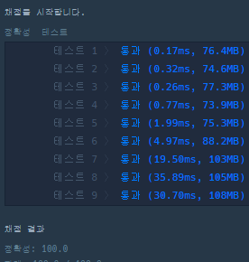

```java
import java.util.*;
class Solution {
    ArrayList<Integer>[] tree;
    public int solution(int n, int[][] edge) {
        int answer = 0;
        // 그래프 구조를 만든다.
        tree = new ArrayList[n + 1];
        for(int i=0; i<=n; i++) {
            tree[i] = new ArrayList<>();
        }
        for(int i=0; i<edge.length; i++) {
            int[] temp = edge[i];
            int a = temp[0];  // vertex는 2차원배열이므로 두개의 값만 비교
            int b = temp[1];
            tree[a].add(b); // a가 b로 연결되면 b도 a로 연결되므로 서로 값을 트리에다가 넣어줌
            tree[b].add(a);
        }
        return bfs(1); // 1 부터 시작
    }

    public int bfs(int nodeVal){
        int tree_size = tree.length;
        int[] check = new int[tree_size + 1]; // 노트 방문 체크

        Queue<Integer> q = new LinkedList<>();
        q.add(nodeVal); 
        check[nodeVal] = 1; // 방문거리

        int max = 0;
        while(!q.isEmpty()){
            int qSize = q.size();
            for(int i=0; i<qSize; i++){
                int num = q.poll();
                for(int treeNum : tree[num]){ // 해당 트리 인덱스에 해당하는 값들 조회
                    if(check[treeNum] != 0) { // 새로 들어온 트리가 아닐때
                        continue;
                    }
                    check[treeNum] = check[num] + 1; // 방문거리 + 1
                    max = Math.max(check[treeNum], max); // 최대거리를 찾음
                    q.add(treeNum); // 큐에 해당 값을추가
                }
            }
        }

        int answer = 0;
        for(int i=1; i<=tree_size; i++){ // 가장 긴거리 찾기
            if(check[i] == max) {
                answer++;
            }
        }

        return answer;    
    }
}
```

