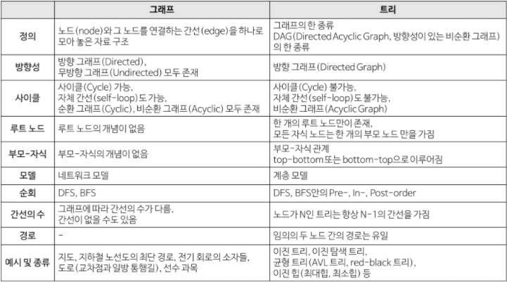
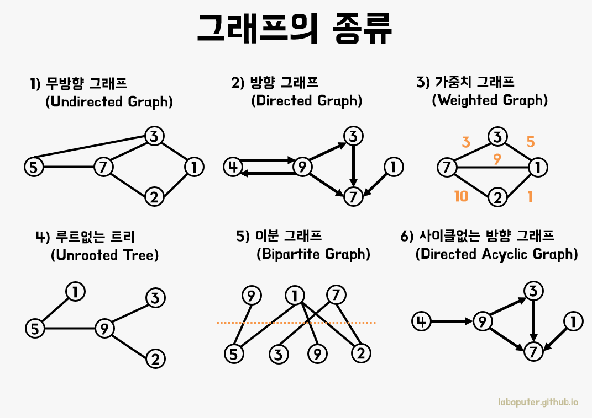

# 그래프
## 그래프란
그래프는 정점(Vertex)과 간선(Edge)으로 이루어진 자료구조이다.\
정확히는 정점(Vertex)간의 관계를 표현하는 조직도라고 볼 수 있다.\
이러한 면에서 트리는 그래프의 일종인 셈이다.

하지만 그래프는 트리와는 달리 정점마다 간선이 있을 수도 있고 없을 수도 있으며, 루트노드와 부모와 자식이라는 개념이 존재하지 않는다.

## 그래프와 트리의 차이

## 그래프 용어

정점(Vertex) : 노드(node) 라고도 하며 정점에는 데이터가 저장된다. (0, 1, 2, 3)
간선(Edge) : 정점(노드)를 연결하는 선으로 link, branch 라고도 부른다.
인접 정점(adjacent Vertex) : 간선에 의해 직접 연결된 정점 (0과 2은 인접정점)
단순 경로(simple path) : 경로 중에서 반복되는 정점이 없는 경우. 한붓그리기와 같이 같은 간선을 지나가지 않는 경로 ( 0->3->2->1 은 단순경로 )
차수(degree) : 무방향 그래프에서 하나의 정점에 인접한 정점의 수 (0의 차수는 3)
진출 차수(in-degree) : 방향 그래프에서 외부로 향하는 간선의 수
진입 차수(out-degree) : 방향 그래프에서 외부에서 들어오는 간선의 수
경로 길이(path length) : 경로를 구성하는데 사용된 간선의 수
사이클(cycle) : 단순 경로의 시작 정점과 종료 정점이 동일한 경우

## 그래프 종류

