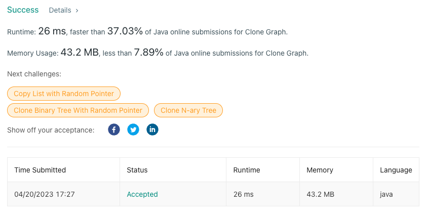

<h2><a href="https://leetcode.com/problems/clone-graph/">133. Clone Graph</a></h2><h3>Medium</h3><hr><div><p>Given a reference of a node in a <strong><a href="https://en.wikipedia.org/wiki/Connectivity_(graph_theory)#Connected_graph" target="_blank">connected</a></strong> undirected graph.</p>

<p>Return a <a href="https://en.wikipedia.org/wiki/Object_copying#Deep_copy" target="_blank"><strong>deep copy</strong></a> (clone) of the graph.</p>

<p>Each node in the graph contains a value (<code>int</code>) and a list (<code>List[Node]</code>) of its neighbors.</p>

<pre>class Node {
    public int val;
    public List&lt;Node&gt; neighbors;
}
</pre>

<p>&nbsp;</p>

<p><strong>Test case format:</strong></p>

<p>For simplicity, each node's value is the same as the node's index (1-indexed). For example, the first node with <code>val == 1</code>, the second node with <code>val == 2</code>, and so on. The graph is represented in the test case using an adjacency list.</p>

<p><b>An adjacency list</b> is a collection of unordered <b>lists</b> used to represent a finite graph. Each list describes the set of neighbors of a node in the graph.</p>

<p>The given node will always be the first node with <code>val = 1</code>. You must return the <strong>copy of the given node</strong> as a reference to the cloned graph.</p>

<p>&nbsp;</p>
<p><strong class="example">Example 1:</strong></p>

<pre><strong>Input:</strong> adjList = [[2,4],[1,3],[2,4],[1,3]]
<strong>Output:</strong> [[2,4],[1,3],[2,4],[1,3]]
<strong>Explanation:</strong> There are 4 nodes in the graph.
1st node (val = 1)'s neighbors are 2nd node (val = 2) and 4th node (val = 4).
2nd node (val = 2)'s neighbors are 1st node (val = 1) and 3rd node (val = 3).
3rd node (val = 3)'s neighbors are 2nd node (val = 2) and 4th node (val = 4).
4th node (val = 4)'s neighbors are 1st node (val = 1) and 3rd node (val = 3).
</pre>

<p><strong class="example">Example 2:</strong></p>

<pre><strong>Input:</strong> adjList = [[]]
<strong>Output:</strong> [[]]
<strong>Explanation:</strong> Note that the input contains one empty list. The graph consists of only one node with val = 1 and it does not have any neighbors.
</pre>

<p><strong class="example">Example 3:</strong></p>

<pre><strong>Input:</strong> adjList = []
<strong>Output:</strong> []
<strong>Explanation:</strong> This an empty graph, it does not have any nodes.
</pre>

<p>&nbsp;</p>
<p><strong>Constraints:</strong></p>

<ul>
	<li>The number of nodes in the graph is in the range <code>[0, 100]</code>.</li>
	<li><code>1 &lt;= Node.val &lt;= 100</code></li>
	<li><code>Node.val</code> is unique for each node.</li>
	<li>There are no repeated edges and no self-loops in the graph.</li>
	<li>The Graph is connected and all nodes can be visited starting from the given node.</li>
</ul>
</div>

## 문제에서 주어지는 Node 클래스
```java
class Node {
    public int val;
    public List<Node> neighbors;
    public Node() {
        val = 0;
        neighbors = new ArrayList<Node>();
    }
    public Node(int _val) {
        val = _val;
        neighbors = new ArrayList<Node>();
    }
    public Node(int _val, ArrayList<Node> _neighbors) {
        val = _val;
        neighbors = _neighbors;
    }
}
```

## 문제풀이
```java
//해당 문제는 인풋 아웃풋이 도저히 어떻게 되는지 이해를 잘 못하여, 힌트를 많이 참고하였습니다....
class Solution {
    //문제에서 주어진 개수는 최대 100개
    Node[] nodes = new Node[100];
    public Node cloneGraph(Node node) {
        if(node == null) return null;
        int index = node.val-1;
        //만약 해당 배열의 노드가 널인 경우
        if(nodes[index] == null) {
            //노드 새로 생성(값 복사)
            //노드 새로 생성 시 neighbors가 없으면 새로 ArrayList를 생성해준다.
            nodes[index] = new Node(node.val);
            //이웃 노드들을 모두 탐색
            for(Node innerNode : node.neighbors) {
                //새로 생성한 노드의 이웃들에 이웃들 노드 값을 넣어준다.
                nodes[index].neighbors.add(cloneGraph(innerNode));
            }   
        }
        return nodes[index];
    }
}
```

## 결과

