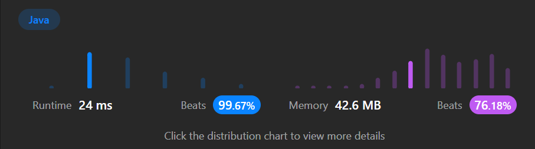

```java

/*
// Definition for a Node.
class Node {
    public int val;
    public List<Node> neighbors;
    public Node() {
        val = 0;
        neighbors = new ArrayList<Node>();
    }
    public Node(int _val) {
        val = _val;
        neighbors = new ArrayList<Node>();
    }
    public Node(int _val, ArrayList<Node> _neighbors) {
        val = _val;
        neighbors = _neighbors;
    }
}
*/

class Solution {
    @Test
    public void sol_test () {
        Solution solution = new Solution();

        
        Node node1 = new Node(1);
        Node node2 = new Node(2);
        Node node3 = new Node(3);
        Node node4 = new Node(4);

        node1.neighbors = Arrays.asList(node2, node4);
        node2.neighbors = Arrays.asList(node1, node3);
        node3.neighbors = Arrays.asList(node2, node4);
        node4.neighbors = Arrays.asList(node1, node3);
        
        //1
        Node clonedNode1 = solution.cloneGraph(node1);
        System.out.println("-----> 예제 1: " + (clonedNode1 != null && clonedNode1.val == 1 && clonedNode1.neighbors.size() == 2)); // Output: true

        //2
        Node emptyNode = new Node(1);
        Node clonedEmptyNode = solution.cloneGraph(emptyNode);
        System.out.println("-----> 예제 2: " + (clonedEmptyNode != null && clonedEmptyNode.val == 1 && clonedEmptyNode.neighbors.isEmpty())); // Output: true

        //3
        Node nullNode = solution.cloneGraph(null);
        System.out.println("-----> 예제 3: " + (nullNode == null)); // Output: true
    }
    
    
      private HashMap<Node, Node> visited = new HashMap<>();

    public Node cloneGraph(Node node) {
        if (node == null) {
            return null;
        }

        // 이미 방문한 노드일 경우 복제된 노드를 반환
        if (visited.containsKey(node)) {
            return visited.get(node);
        }

        // 노드 클론
        Node cloneNode = new Node(node.val, new ArrayList<>());
        visited.put(node, cloneNode);

        // 이웃 노드들을 순회하며 그래프를 깊이 우선 탐색으로 클론
        for (Node neighbor : node.neighbors) {
            Node clonedNeighbor = cloneGraph(neighbor);
            cloneNode.neighbors.add(clonedNeighbor);
        }

        return cloneNode;
    }
}
```