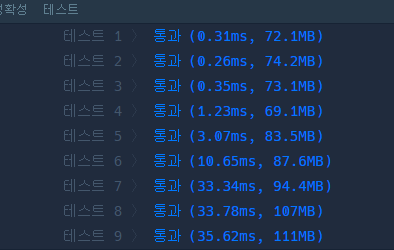

1. 간선 정보를 인접 리스트로 생성.
2. 
```java
import java.util.*;

class DooDoomChit {
    
    @Test
    void testSolution() {
        DooDoomChit solution = new DooDoomChit();

        int n1 = 6;
        int[][] edge1 = {{3, 6}, {4, 3}, {3, 2}, {1, 3}, {1, 2}, {2, 4}, {5, 2}};
        int expected1 = 3;
        assertEquals(expected1, dooDoomChit.solution(n1, edge1));

    }
    
    public int solution(int n, int[][] edge) {
        // 주어진 간선 정보를 사용하여 인접 리스트를 생성
        //인접 리스트는 각 노드와 연결된 이웃 노드들의 정보를 저장
        // 빈 인접리스트를 수만큼 미리 저장
        // 노드 번호가  1부터 시작하기때문에 맞추기 편하게끔.
        ArrayList<ArrayList<Integer>> adjList = new ArrayList<>();
        for (int i = 0; i < n+1; i++) {
            adjList.add(new ArrayList<>());
        }
        //edge1 = {{3, 6}, {4, 3}, {3, 2}, {1, 3}, {1, 2}, {2, 4}, {5, 2}};
        // arrayList 안에 arrayList가 들어가 있으므로
        // [0]현 간선의 한끝의 노드에 대한 인접리스트 가져옴/. 
        // ex) particleOfEdge[0] = 3, particleOfEdge[1]= 6
        //  adjList.get(particleOfEdge[0])는 particleOfEdge[0]번 노드에 대한 인접리스트 
        //  ex) adjList.get(3)가 되고 3번의 인접리스트 가져올것이고
        // .add(particleOfEdge[1])는 가져온 인접 리스트에 e[1]번 노드를 추가한다.
        // 3,6 이었으니까 3번 노드 인접 리스트에 6번을 추가한다.
        for (int[] particleOfEdge : edge) {
            adjList.get(particleOfEdge[0]).add(particleOfEdge[1]);
            adjList.get(particleOfEdge[1]).add(particleOfEdge[0]);
        }
            // 인접리스트 생성 끝
        
        int[] distance = new int[n + 1]; //노드번호 시작 1부터 
        // distance 배열의 모든 원소를 -1로 초기화
        for (int i = 0; i < distance.length; i++) {
            distance[i] = -1; // 방문 안했다고 표시를 -1로 하니까 모두 -1로 초기화
        }
        
        distance[1] = 0;
        Queue<Integer> queue = new LinkedList<>();
        queue.add(1); //1번 노드에서 시작해서 멀리 떨어진것을 구하는 문제라 1추가

        // BFS를 시작하고 각 노드까지의 최단 거리 구함.
        while (!queue.isEmpty()) {// 큐가 빌때까지 한다. BFS니까
            int currentNode = queue.poll();  // 비어있지 않으면 꺼낸다.
            // 현재 노드와 연결된 이웃 노드들을 탐색
            for (int neighbor : adjList.get(currentNode)) { // 현재 노드하고 꺼내
                // 이웃 노드에 아직 방문하지 않았다면  -1 로 위에서 표시 
                if (distance[neighbor] == -1) { 
                    // 현재 노드의 거리에 1을 더하여 이웃 노드의 거리를 표시
                    distance[neighbor] = distance[currentNode] + 1;
                    // 이웃 노드를 큐에 추가하여 다음번 찾기에 사용
                    queue.add(neighbor);
                }
            }
        }

        // 최단 거리 중 가장 큰 값을 찾고, 그 값과 같은 거리를 가진 노드의 개수를 반환
        int maxDist = 0;
        int count = 0;
        for (int i = 1; i <= n; i++) {
            if (distance[i] > maxDist) {
                maxDist = distance[i];
                count = 1;
            } else if (distance[i] == maxDist) {
                count++;
            }
        }

        return count;
    }
}
```

