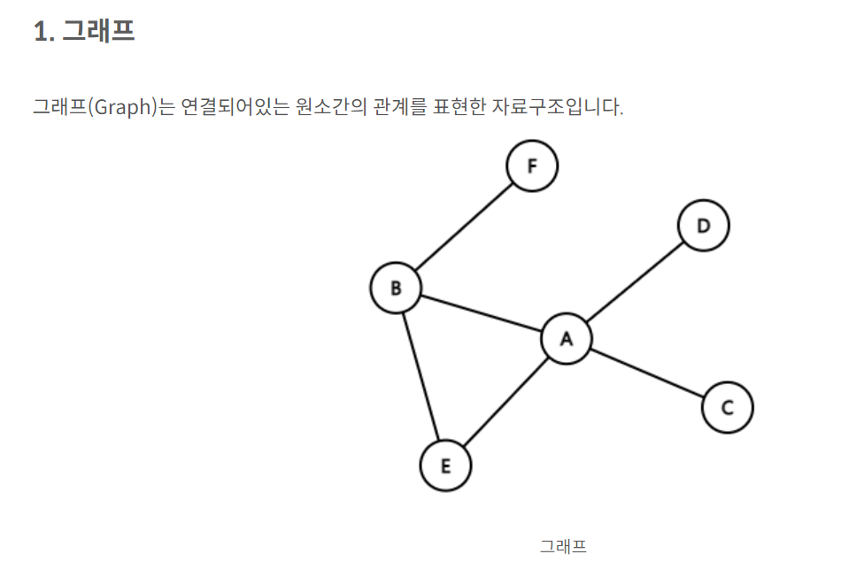
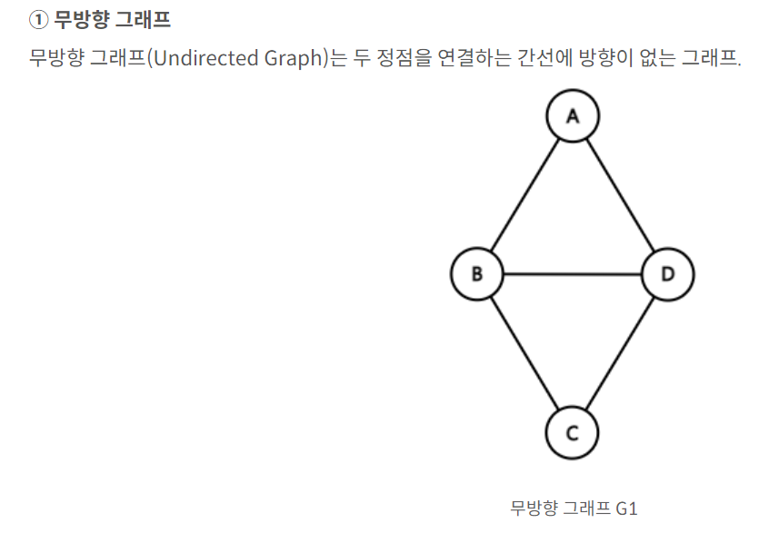
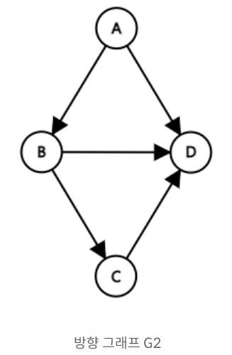

# 자료구조
## 그래프

### 그래프란?
- 객체 간의 이진 관계를 표현하는데 사용된다.
- 그래프의 두 가지 요소
  1. 정점 (VerTex) : 그래프의 개별 객체를 나타내며, 노드라고 부른다.
  2. 간선 (Edge) : 두 정점 사이의 관계를 나타내며, 그래프에서 이러한 관계를 연결하는 선으로 표현된다.
- 그래프의 주요 분류
  1. 무방향 그래프 (Undirected Graph) :  간선에 방향이 없는 그래프로 정점 간의 관계가 상호적 입니다.
  2. 방향 그래프 (Weighted Graph) : 간선에 가중치가 있는 그래프로, 간선마다 값이 할당되어 정점 사이의 관계 강도를 표현한다.
  3. 다중 그래프(Multi Graph) : 두 정점 사이에 여러 간선이 존재할 수 있는 그래프이다.
- 그래프의 개념과 성질
  1. 차수 (Degree) :  정점의 차수는 해당 정점에서 나가거나 들어오는 간선의 수를 의미한다.  
  방향 그래프의 경우, 차수는 두가지로 나뉜다.
     1. 진입 차수(In-degree) : 정점으로 들어오는 간선의 수
     2. 진출 차수 (Out-degree) : 정점에서 나가는 간선의 수
  2. 경로 (Path) : 그래프에서 두 정점 사이의 연속된 간선들의 순서를 경로라고 한다.  
  경로의 길이는 간선의 수로 나타낸다.
  3. 순환 (Cycle) : 시작 정점과 도착 정점이 동일한 경로를 순환이라고 한다.
  4. 연결성(Connectivity) : 무방향 그래프에서 모든 정점들이 서로 연결된 경우, 그래프는 연결되었다고 합니다.  
  방향 그래프의 경우, 모든 정점들이 서로 갈 수 있는 경로가 존재하면 강하게 연결되었다고 한다.
  5. 서브 그래프(Sub graph) : 그래프의 일부 정점과 간선으로 구성된 그래프를 서브 그래프라고 한다.
  6. 이분 그래프(Bipartite Graph) : 정점 집합을 두 개의 부분 집합으로 나눌 수 있고,  
  각 간선이 다른 부분 집합에 속한 두 정점을 연결하는 그래프를 이분 그래프라고 한다.

### 그래프 
- 무방향 그래프(Undirected Graph)는 두 정점을 연결하는 간선에 반향이 없는 그래프 
- 
- 그래프는 연결할 객체를 나타내는 정점(Vertex)과 객체를 연결하는 간선(Edge)의 집합으로 구성된다.
- 그래프 G를 G=(V,E)로 정의하는데, V는 정점의 집합, E는 간선들의 집합을 의미한다.

### rmf

### 그래프의 종류
#### 1. 무방향 그래프
- 
- 무방향 그래프에서 정점 Vi와 Vj를 연결하는 간선을 (Vi,Vj)로 표현하는데, 이때 (Vi,Vj)와 (Vj, Vi)는 같은 간선을 나타낸다.
- V(G1) = {A,B,C,D}, E(G1)={(A,B), (A,D), (B,C), (B,D), (C,D)}

#### 2. 방향 그래프
- 방향 그래프 (Directed Graph)는 간선에 방향이 있는 그래프
- 
- 방향 그래프에서 정점 Vi와 Vj를 연결하는 간선을 <Vi,Vj>로 표현하는데 Vi를 꼬리(tail), Vj를 머리(Head)라고 한다.  
이때 <Vi,Vj>와 <Vj, Vi>는 서로 다른 간선이다.
- V(G1) = {A,B,C,D} E(G1) = {<A,B>, <A,D>, <B,C>, <B,D>, <C,D>}

