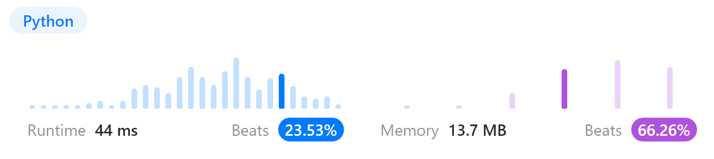
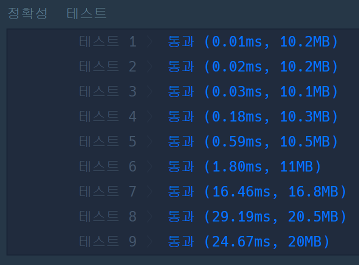

# 문제풀이
## 133. Clone Graph

### Discription  
요약) 노드로 이루어진 그래프가 주어졌을 때 그래프를 hard copy하고 첫 번째 노드를 반환하라  
https://leetcode.com/problems/clone-graph/description/  

### Solution

```python
"""
# Definition for a Node.
class Node(object):
    def __init__(self, val = 0, neighbors = None):
        self.val = val
        self.neighbors = neighbors if neighbors is not None else []
"""

class Solution(object):
    def __init__(self):
        self.visited = {}

    def cloneGraph(self, node):
        """
        :type node: Node
        :rtype: Node
        """

        if not node:
            return None
        
        if node in self.visited:
            return self.visited[node]

        res = Node(node.val)
        self.visited[node] = res

        for n in node.neighbors:
            res.neighbors.append(self.cloneGraph(n))
        
        return res
```
  
map(visited)에다 노드를 하드카피 뜬 뒤에  
원본 노드를 dfs로 순회하며 맵에 카피해 둔 노드에다 neighbor를 붙인다  
map에 저장된 노드들은 (new) Node(node.val)로 생성되었으므로 모두 하드카피된 노드이다  
마지막으로 첫 번째 노드를 반환한다  

## 가장 먼 노드

### 문제 설명
요약) 양방향 그래프가 주어졌을 때 1번 노드에서 가장 먼 노드 개수를 반환하라  
https://school.programmers.co.kr/learn/courses/30/lessons/49189  

### Solution

```python
from collections import deque

def solution(n, edge):
    adj = [[] for _ in range(n+1)]
    visited = [0] * (n+1)
    for a, b in edge:
        adj[a].append(b)
        adj[b].append(a)
    
    visited[1] = 1
    q = deque([1])
    
    while q:
        node = q.popleft()
        for neighbor in adj[node]:
            if visited[neighbor] == 0:
                visited[neighbor] = visited[node] + 1
                q.append(neighbor)
    
    most_far = max(visited)
    count = visited.count(most_far)
    
    return count
```
  
bfs를 이용해 1번 노드부터 전체 노드를 순회한 뒤 가장 멀리 있는 노드 개수를 반환한다  
핵심은 한 간선은 하나만 표시되어 있는 input 데이터를  
adj[노드] = [연결된 노드 리스트] 형태로 다시 만드는 것이다  
인덱스가 현재 노드이고, 첫 번째 노드가 1번이니 1번에 연결된 노드부터 bfs를 돌리면 전체 탐색이 가능하다  

예)  
  
input : [[3, 6], [4, 3], [3, 2], [1, 3], [1, 2], [2, 4], [5, 2]]  
adj : 	[[], [3, 2], [3, 1, 4, 5], [6, 4, 2, 1], [3, 2], [2], [3]]  
