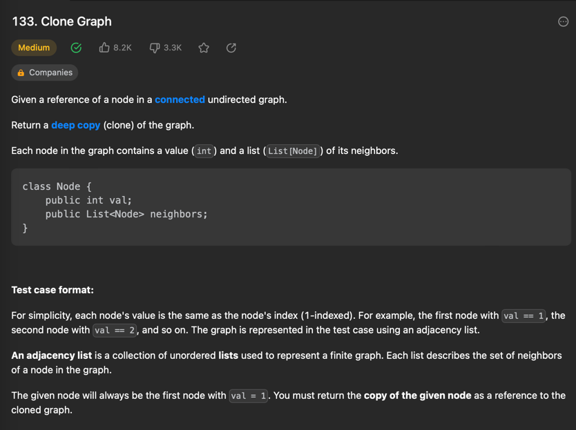
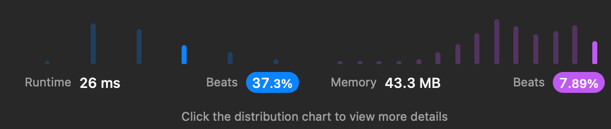

## [cloneNode](https://leetcode.com/problems/clone-graph/)




```java
 import java.util.Map;
/*
// Definition for a Node.
class Node {
    public int val;
    public List<Node> neighbors;
    public Node() {
        val = 0;
        neighbors = new ArrayList<Node>();
    }
    public Node(int _val) {
        val = _val;
        neighbors = new ArrayList<Node>();
    }
    public Node(int _val, ArrayList<Node> _neighbors) {
        val = _val;
        neighbors = _neighbors;
    }
}
*/

class Solution {
    public Node cloneGraph(Node node) {
        if(node == null) return null;
        Map <Integer, Node> map = new HashMap<>();
      
        return cloneGraph(map, node);
    }

    public Node cloneGraph(Map<Integer, Node> map, Node node){
        if(map.containsKey(node.val)) {
            return map.get(node.val);
        }
        Node copy = new Node(node.val);
        map.put(node.val, copy);
        System.out.println(node.val);
        
        for(Node neighbor : node.neighbors) {
            copy.neighbors.add(cloneGraph(map, neighbor));
        }
        return copy;
    }
}
```



