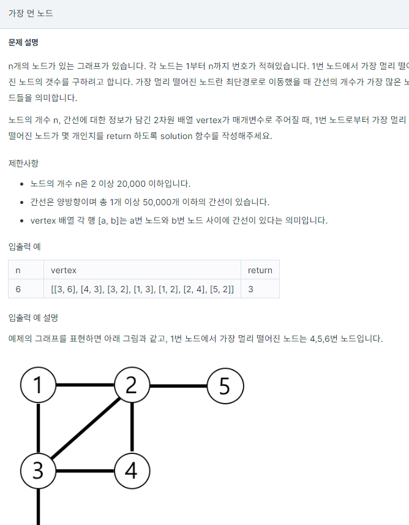
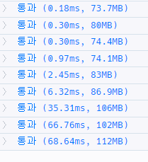

# [가장 먼 노드](https://school.programmers.co.kr/learn/courses/30/lessons/49189)




```java
import java.util.*;
class Solution {
    static ArrayList<ArrayList<Integer>> graph = new ArrayList<>();
    static boolean[] visited;
    
    public int solution(int n, int[][] edge) {
        int answer = 0;
        visited = new boolean[n+1];
        for(int i = 0; i<n ;i++){
            graph.add(i, new ArrayList<>());
        }
        
        for (int i = 0; i <= n; i++) {
            graph.add(i, new ArrayList<>());
        }

        for (int i = 0; i < edge.length; i++) {    
            graph.get(edge[i][0]).add(edge[i][1]);
            graph.get(edge[i][1]).add(edge[i][0]);
        }
        answer = makeEdge();
        
        return answer;
    }
    
    static int makeEdge(){
        Queue<Integer> q = new LinkedList<>();
        q.add(1);
        visited[1] = true;

        int cnt = 0;
        while (true) {
            Queue<Integer> temp = new LinkedList<>();

            while (!q.isEmpty()) {
                int cur = q.poll();
                for (int adj : graph.get(cur)) {
                    if (!visited[adj]) {
                        temp.add(adj);
                        visited[adj] = true;
                    }
                }
            }
            
            if (temp.isEmpty()) break;
            q.addAll(temp);
            cnt = temp.size();
        }
        return cnt;
    } 
}
```

