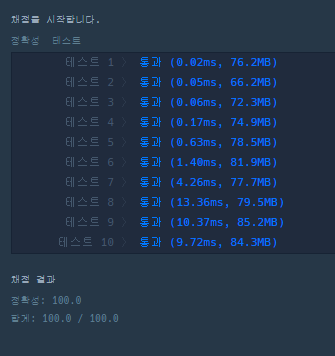

```java
class Solution {
    public int solution(int n, int[][] results) {
        int answer = 0;

        boolean[][] winLose = new boolean[n + 1][n + 1];  // 승패담기

        for (int i = 0; i < results.length; i++) {  // 승자 패자 저장
            int win = results[i][0];
            int lose = results[i][1];

            winLose[win][lose] = true;
        }

        for (int i = 1; i <= n; i++) {
            for (int j = 1; j <= n; j++) {
                for (int k = 1; k <= n; k++) {
                    if (winLose[j][i] && winLose[i][k]) { // a가 b를 이기고 b가 c를 이겼을 때 a가 c를 이기는 경우를 저장
                        winLose[j][k] = true;
                    }
                }
            } 
        }

        for (int i = 1; i <= n; i++) {
            boolean success = true;
            for (int j = 1; j <= n; j++) {
                if (!winLose[i][j] && !winLose[j][i] && i != j) { // 모든 경우 찾기
                    success = false;
                    break;
                }
            }
            if (success) {
                answer++;
            }
        }
        return answer;
    }
}
```
