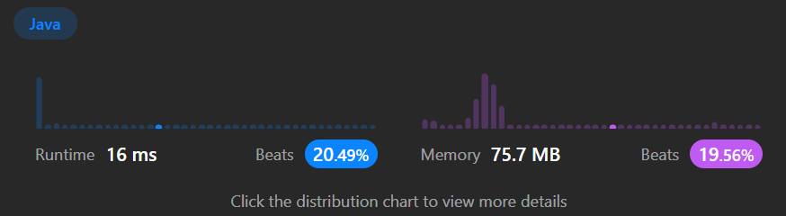

```java
package algorithm.leetcode.centerStar;

import org.junit.jupiter.api.Test;

import java.util.*;

import static org.junit.jupiter.api.Assertions.assertEquals;

public class Solution {

    /* ------------------*/
        @Test
        public void testFindCenter() {
            Solution solution = new Solution();

            // 1
            int[][] edges1 = {{1, 2}, {2, 3}, {4, 2}};
            int expected1 = 2;
            int result1= solution.findCenter(edges1);
            assertEquals(expected1, result1);

            // 2
            int[][] edges2 = {{1, 2}, {5, 1}, {1, 3}, {1, 4}};
            int expected2 = 1;
            int result2 = solution.findCenter(edges2);
            assertEquals(expected2, result2);

        }

                    /*     ------------*/
    public int findCenter(int[][] edges) {
        // 간선 리스트를 생성하여 노드 간의 연결 정보를 저장
        List<List<Integer>> graph = new ArrayList<>();
        int n = edges.length + 1; // 노드의 개수는 간선의 개수 + 1

        // 그래프 초기화
        for (int i = 0; i <= n; i++) {
            graph.add(new ArrayList<>());
        }

        // 간선 정보를 바탕으로 그래프 구성
        for (int[] edge : edges) {
            int u = edge[0];
            int v = edge[1];
            graph.get(u).add(v);
            graph.get(v).add(u);
        }

        // 그래프의 노드 중에서 연결된 노드의 개수가 n-1인 노드가 센터 노드가 됨
        for (int i = 1; i <= n; i++) {
            if (graph.get(i).size() == n - 1) {
                return i;
            }
        }

        return -1; // 유효한 스타 그래프가 아닌 경우 -1 반환
    }
}

```