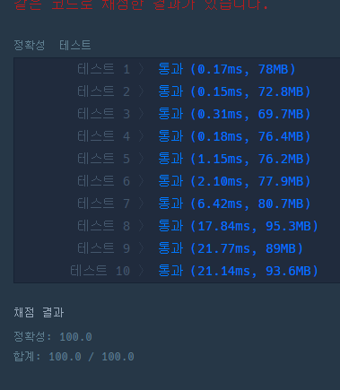

```java
package algorithm.programars.ranking;

import org.junit.jupiter.api.Test;

import java.util.*;

import static org.junit.jupiter.api.Assertions.assertEquals;

public class BoxingRanking {

    @Test
    public void testBoxingRanking() {
        // BoxingRanking 클래스의 인스턴스를 생성.
        BoxingRanking boxingRanking = new BoxingRanking();

        //TestCase
        //  n은 선수의 수
        //  results 경기결과
        // expected1은 예상되는 정확한 순위를 매길 수 있는 선수의 수.
        int n = 5;
        int[][] results = {{4, 3}, {4, 2}, {3, 2}, {1, 2}, {2, 5}};
        int expected = 2;

        assertEquals(expected, boxingRanking.solution(n, results));
    }
    public int solution(int n, int[][] results) {
        // 각 선수가 이긴 상대들의 목록을 저장하는 리스트
        List<Set<Integer>> winList = new ArrayList<>();
        // 각 선수가 진 상대들의 목록을 저장하는 리스트
        List<Set<Integer>> loseList = new ArrayList<>();

        // 각 선수에 대해 빈 Set을 초기화.
        for (int i = 0; i <= n; i++) {
            winList.add(new HashSet<>());
            loseList.add(new HashSet<>());
        }
        // 결과 배열에서 승리자와 패자를 추출.
        for (int[] result : results) {
            int winner = result[0];
            int loser = result[1];

            winList.get(winner).add(loser);
            loseList.get(loser).add(winner);
        }
        // 각 선수의 승리/패배 기록을 완전한 목록
        for (int i = 1; i <= n; i++) {
            // 선수 i를 이긴 선수들의 목록에 대해, 선수 i가 이긴 선수들도 이긴 것으로 처리.
            for (int winner : loseList.get(i)) {
                winList.get(winner).addAll(winList.get(i));
            }
            // 선수 i에게 진 선수들의 목록에 대해, 선수 i에게 진 선수들도 진 것으로 처리.
            for (int loser : winList.get(i)) {
                loseList.get(loser).addAll(loseList.get(i));
            }
        }

        int answer = 0;
        // 각 선수의 승리/패배 기록을 확인하여 순위를 확정할 수 있는 선수의 수를 구한다.
        for (int i = 1; i <= n; i++) {
            if (winList.get(i).size() + loseList.get(i).size() == n - 1) {
                answer++;
            }
        }

        return answer;
    }
}
```