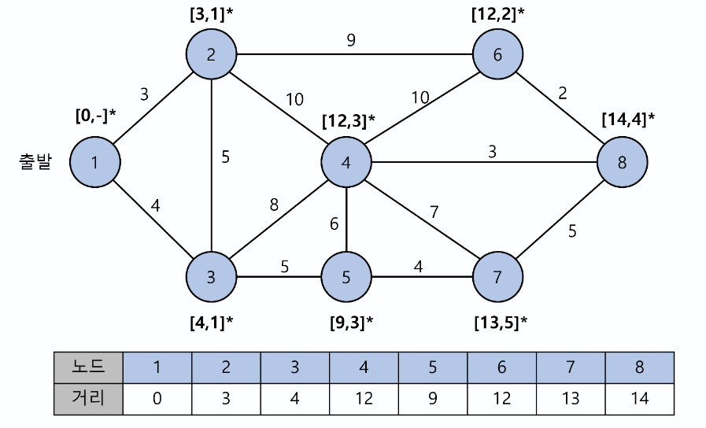

# 다익스트라 알고리즘
  

## 다익스트라 알고리즘이란?
다익스트라(Dijkstra) 알고리즘, 데이크스트라 알고리즘이라고도 한다.  
한 노드에서 모든 노드로 가는 최단거리를 모두 구하는 One to All 알고리즘이다.  
음의 거리(가중치)가 있는 경우는 최단거리를 구할 수 없다.  
현실 세계에서는 음의 거리가 존재하지 않으므로 지도 네비게이션 같은 현실세계의 문제에 적용하는 경우가 많다.  

## 알고리즘의 풀이
1. 방문할 노드의 개수만큼 거리를 저장할 배열을 만든다.
2. 시작 노드에 거리 0을 설정하고, 나머지 노드에 거리 무한대(주로 이론적으로 최대값)를 설정한다.
3. 출발 노드에서 방문할 수 있는 모든 노드를 방문하며 거리를 기록한다.
4. 거리 배열에서 해당 노드에 도착하는데 소모한 거리가 현재 배열보다 작으면 거리 배열을 갱신한다.
5. 이동한 노드에서부터 다시 방문할 수 있는 모든 노드를 방문한다.
6. 이미 방문한 노드는 방문처리를 하고 다시 방문하지 않는다.
7. 모든 노드를 방문할 때 까지 4-6을 반복한다.

## 알고리즘의 구현
```python
from collections import deque

graph = [
    [0,  3, 4,  0, 0,  0, 0, 0],
    [3,  0, 5,  0, 0,  9, 0, 0],
    [4,  5, 0,  8, 5,  0, 0, 0],
    [0, 10, 8,  0, 6, 10, 7, 3],
    [0,  0, 5,  6, 0,  0, 4, 0],
    [0,  9, 0, 10, 0,  0, 0, 2],
    [0,  0, 0,  7, 5,  0, 0, 5],
    [0,  0, 0,  4, 0,  2, 5, 0],
]

distance = [0] * len(graph)
visited = [0] * len(graph)

INF = 0xFFFFFFFF
# start = 1
for i in range(len(distance)):
    if (i+1) != 1:
        distance[i] = INF

q = deque([0])
while q:
    cur = q.popleft()
    visited[cur] = 1
    for i in range(len(graph)):
        edge = graph[cur][i]
        if edge != 0 and visited[i] == 0:
            dist = distance[cur] + edge
            distance[i] = min(distance[i], dist)
            q.append(i)

print(distance)
```
