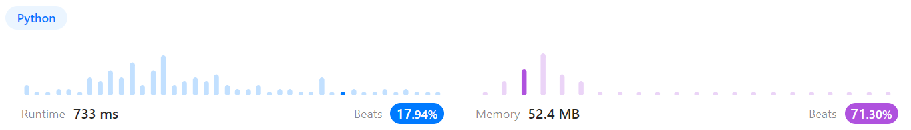
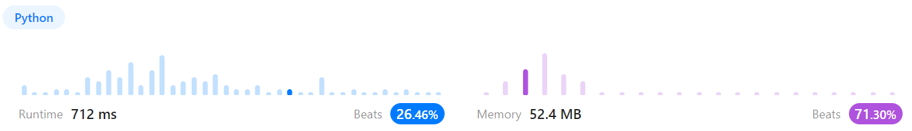
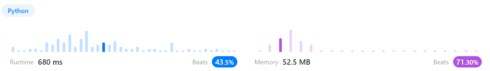
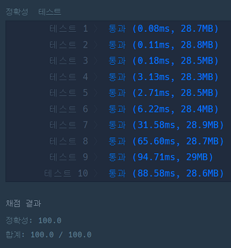

# 문제풀이
## 1791. Find Center of Star Graph

### Discription  
요약) 스타 그래프는 하나의 중심 노드와 중심 노드를 다른 모든 노드와 연결하는 정확히 n - 1개의 가장자리가 있는 그래프이다.  
스타 그래프가 주어졌을 때 스타 그래프의 중심 노드를 찾아라.  
https://leetcode.com/problems/find-center-of-star-graph/  

### Solution

```python
import numpy as np

class Solution(object):
    def findCenter(self, edges):
        """
        :type edges: List[List[int]]
        :rtype: int
        """
        n = len(edges) + 1
        graph = [[0]*n for _ in range(n)]

        for x, y in edges:
            graph[x-1][y-1] = 1

        graph = np.array(graph)
        xSum = graph.sum(axis=1)
        ySum = graph.sum(axis=0)
        res = (xSum + ySum).tolist()

        return res.index(n-1)+1
```
입력을 받아 2차원 그래프를 그린 후  
배열의 (가로합+세로합)=전체노드개수-1 인 노드를 반환하는 코드  
시간초과로 실패했다.  

```python
class Solution(object):
    def findCenter(self, edges):
        n = len(edges) + 1
        x = [0]*n
        y = [0]*n

        for xEdge, yEdge in edges:
            x[yEdge-1] += 1
            y[xEdge-1] += 1
        
        res = [x[i]+y[i] for i in range(n)]

        return res.index(n-1)+1
```
  
위와 같은 방법인데 2차원 배열이 아니라 엣지만 표시하는 방법  

```python
class Solution(object):
    def findCenter(self, edges):
        res = set(edges[0])
        for edge in edges:
            res = res & set(edge)

        return list(res)[0]
```
  
스타 그래프는 연결된 노드가 중앙의 한 노드와 말단 노드 사이밖에 없다  
즉 모든 링크의 교집합을 찾으면 그게 중앙 노드이다  

```python
class Solution(object):
    def findCenter(self, edges):
        a = set(edges[0])
        b = set(edges[1])

        return list(a & b)[0]
```
  
스타 그래프는 교집합 노드가 단 하나밖에 나올 수 없으므로  
첫 번째 엣지와 두 번째 엣지, 단 두 개만 비교하면 중앙 노드를 구할 수 있다  

## 순위

### 문제 설명
요약) 선수의 수 n, 경기 결과를 담은 2차원 배열 results가 매개변수로 주어질 때 정확하게 순위를 매길 수 있는 선수의 수를 return 하라.  
경기 결과는 분실된 부분이 있어 정확하게 순위를 매길 수 있는 선수만 찾아내야 한다.  
https://school.programmers.co.kr/learn/courses/30/lessons/49191  

### Solution

```python
import numpy as np

def solution(n, results):
    graph = [[0] * n for _ in range(n)]
    
    for win, lose in results:
        graph[win-1][lose-1] = 1
        
    for k in range(n):
        for x in range(n):
            for y in range(n):
                # 결과가 승인지 모를 때만 검사
                if graph[x][y] == 0:
                    # x가 k를 이기고 k가 y를 이겼으면 x가 y를 이긴 것
                    if graph[x][k] == 1 and graph[k][y] == 1:
                        graph[x][y] = 1
    
    graph = np.array(graph)
    xSum = graph.sum(axis=1)
    ySum = graph.sum(axis=0)
    res = (xSum + ySum).tolist()

    return res.count(n-1)
```
  
먼저 주어진 승패를 가지고 2차원 배열을 만든다.  
만들어진 그래프에서 가로축은 승, 세로축은 패를 뜻한다.  
다음으로 주어진 승패로 유추할 수 있는 승을 찾는다.  
예를 들어 a가 b를 이기고 b가 c를 이기면 a는 c를 이긴 것이다.  
모든 관계를 그래프에 표기한 후 x축과 y축의 합(정확한 승패)이 n-1(나와 내가 경기한 경우는 없음)이면 정확한 경기 결과를 알 수 있는 사람이다.  
```
테스트케이스
n	results
5	[[4, 3], [4, 2], [3, 2], [1, 2], [2, 5]]

처음
[0, 1, 0, 0, 0]
[0, 0, 0, 0, 1]
[0, 1, 0, 0, 0]
[0, 1, 1, 0, 0]
[0, 0, 0, 0, 0]

표기한 후
[0, 1, 0, 0, 1]
[0, 0, 0, 0, 1]
[0, 1, 0, 0, 1]
[0, 1, 1, 0, 1]
[0, 0, 0, 0, 0]

가로가 승리한 경기
세로가 패배한 경기가 된다
```

