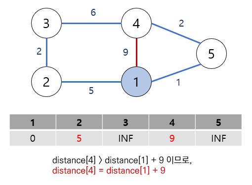

# 다익스트라 알고리즘

## 개념 및 활용법
- 그래프에서 한 정점(노드)에서 다른 정점까지의 최단 경로를 구하는 알고리즘
- 매번 최단 경로의 정점을 선택해 탐색을 반복하는 것으로 최단경로 찾을 때 주로 사용(네비게이션,)

### 구현방법
- 1.순차 탐색
  - '방문하지 않은 노드 중 거리값이 가장 작은 노드'를 선택해 다음 탐색 노드로 삼는다.
  - 노드의 개수만큼 순차 탐색을 수행
  - 시간복잡도  (N−1)×N=O(N2)이라 정점의 갯수는  많은데 간선이 적을 때 엄청나게 비효율적임
- 2.우선순위 큐
  - 거리 값을 담을 우선순위 큐는 힙으로 구현
  - 우선순위 큐가 알아서 최단 거리의 노드를 앞으로 정렬하므로 방문을 기록하는 배열은 불필요
  - 시간복잡도 O(N logN) 간선의 갯수가 비정상적이어도 빠른 처리 가능

### 동작방법

정점들 간의 간선의 가중치는 그림과 같고, distance 배열은 1번 정점에서 특정 정점까지의 최단 경로 길이를 표시
단, 초기에는 최단 경로를 구하지 않은 상태이므로 무한대(아주 큰 값)로 표시

1번과 인접한 정점들의 거리값을 모두 표시

4번으로  갈 때의 경로가 한가지 더 있음. 

1번에서 4번을 바로 가는 것 보다 5번 경로를 거쳐서 갈때 더 짧은 distance로 갈 수가 있음
즉, distance[4] > distance[5] + 2 이므로, distance[4] 를 distance[5]+2 로 업데이트

* 반복

