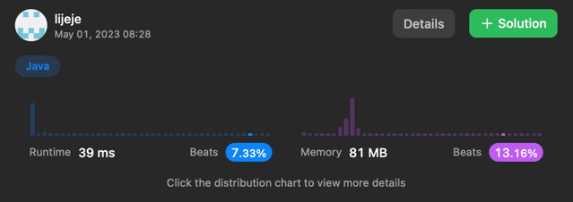
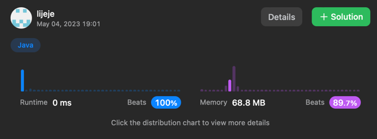

```java
import java.util.Collections;
import java.util.Comparator;
import java.util.HashMap;
import java.util.Map;
import java.util.Map.Entry;

class Solution {
    public int findCenter(int[][] edges) {
        Map map = new HashMap<Integer,Integer>();

        System.out.println(edges[1][0]);
        for(int i =0;i< edges.length/2+1;i++){
            //1열
            if(map.containsKey(edges[i][0])){
                map.replace(edges[i][0], (Integer)map.get(edges[i][0])+1);
            }else{
                map.put(edges[i][0],1);
            }
            //2얼
            if(map.containsKey(edges[i][1])){
                map.replace(edges[i][1], (Integer)map.get(edges[i][1])+1);
            }else{
                map.put(edges[i][1],1);
            }

        }

        Comparator<Entry<Integer, Integer>> comparator = new Comparator<Entry<Integer, Integer>>() {
            @Override
            public int compare(Entry<Integer, Integer> e1, Entry<Integer, Integer> e2) {
                return e1.getValue().compareTo(e2.getValue());
            }
        };


        // Max Value의 key, value
        Entry<Integer, Integer> maxEntry = Collections.max(map.entrySet(), comparator);

        return maxEntry.getKey();
    }
}
```



```java
class Solution {
    public int findCenter(int[][] edges) {
        if(edges[1][0] == edges[0][0] || edges[1][0] == edges[0][1])
            return edges[1][0];
        else return edges[1][1];
    }
}
```

