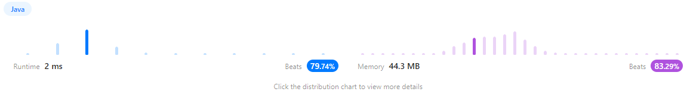

https://leetcode.com/problems/all-paths-from-source-to-target/


Given a directed acyclic graph (DAG) of n nodes labeled from 0 to n - 1, find all possible paths from node 0 to node n - 1 and return them in any order.

The graph is given as follows: graph[i] is a list of all nodes you can visit from node i (i.e., there is a directed edge from node i to node graph[i][j]).


Input: graph = [[1,2],[3],[3],[]]
Output: [[0,1,3],[0,2,3]]
Explanation: There are two paths: 0 -> 1 -> 3 and 0 -> 2 -> 3.


Input: graph = [[4,3,1],[3,2,4],[3],[4],[]]
Output: [[0,4],[0,3,4],[0,1,3,4],[0,1,2,3,4],[0,1,4]]

Constraints:

n == graph.length
2 <= n <= 15
0 <= graph[i][j] < n
graph[i][j] != i (i.e., there will be no self-loops).
All the elements of graph[i] are unique.
The input graph is guaranteed to be a DAG.


0부터 시작하는 모든 경로를 찾아서 리턴해라

```java
class Solution {
    public List<List<Integer>> allPathsSourceTarget(int[][] graph) {
        List<List<Integer>> answer = new ArrayList<>(); //선언
        List<Integer> list =new ArrayList<>();
        list.add(0); // 리스트 시작 담기
        dfs(graph,answer,list,0); // dfs알고리즘
            
        return answer;
    }
    public void dfs(int[][] graph,List<List<Integer>> answer,List<Integer> list, int line){
        if(line == graph.length-1){  // 그래프 배열이 0번부터 시작하므로 1 뺀값이 마지막값
            answer.add(new ArrayList<>(list));
            return;
        }
        for(int i :graph[line]){  // line과 연결된 모든 그래프 노드 탐색
            list.add(i); // 탐색한 노드를 리스트에 추가
            dfs(graph,answer,list,i); // 다시 돌리기 
            list.remove(list.size()-1); // 경로를 다 찾은 후 탐색한 노드 삭제
        }
    }
}
```


