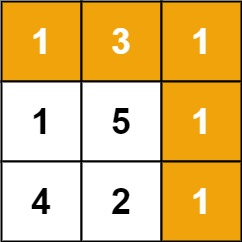
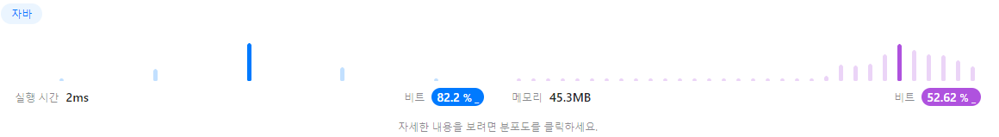

https://leetcode.com/problems/minimum-path-sum/

Given a m x n grid filled with non-negative numbers, find a path from top left to bottom right, which minimizes the sum of all numbers along its path.

Note: You can only move either down or right at any point in time.



Input: grid = [[1,3,1],[1,5,1],[4,2,1]]
Output: 7
Explanation: Because the path 1 → 3 → 1 → 1 → 1 minimizes the sum.

Input: grid = [[1,2,3],[4,5,6]]
Output: 12

Constraints:

m == grid.length
n == grid[i].length
1 <= m, n <= 200
0 <= grid[i][j] <= 100

0,0에서 오른쪽 가장 아래까지 가는 가장 짧은 합을 구하시오

```java
class Solution {
    public int minPathSum(int[][] grid) {
        int y = grid.length;
        int x = grid[0].length;
        
        for(int i=1; i<y; i++) {
            grid[i][0] += grid[i-1][0]; // 위쪽에서 내려오는 값을 현재값에다 더해라
        }
        for(int i=1; i<x; i++) {
            grid[0][i] += grid[0][i-1]; // 오른쪽으로 이동한 값을 현재값에 더해라
        }
        
        int min = 0;
        for(int i=1; i<y; i++) {
            for(int j=1; j<x; j++) {
                min = Math.min(grid[i][j-1], grid[i-1][j]); // 왼쪽과 위쪽중 작은 값을 현재값에 더해라
                grid[i][j] += min;
            }
        }
        
        return grid[y-1][x-1];
    }
}
```

