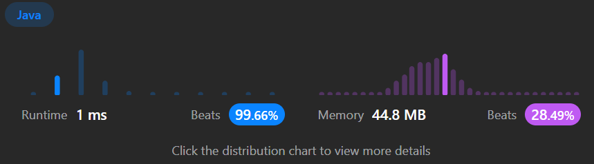

- 만약 경로의 순서까지 확인하고 싶다면, 별도의 로직을 추가 필요?? 
```java
import java.util.*;

public class Solution {

    @Test
    public void testAllPathsSourceTarget() {
        Solution solution = new Solution();

        int[][] graph = {{1,2},{3},{3},{}};
        List<List<Integer>> result = solution.allPathsSourceTarget(graph);
        assertEquals(2, result.size());

        graph = new int[][]{{4,3,1},{3,2,4},{3},{4},{}};
        result = solution.allPathsSourceTarget(graph);
        assertEquals(5, result.size());
    }
    
    public List<List<Integer>> allPathsSourceTarget(int[][] graph) {
        // graph를 입력으로 받아서 0에서 n-1까지의 모든 경로를 List 형태로 반환이 목적인거시다.
        List<List<Integer>> result = new ArrayList<>();// 결과를 저장할 List
        List<Integer> path = new ArrayList<>();// 경로를 저장할 List

        path.add(0); //// 경로는 0에서 시작하므로 먼저 0을 추가
        dfs(graph, 0, result, path); // DFS 시작. 시작 노드는 0

        return result;// 모든 경로를 찾은 후 결과를 반환
    }
    // DFS(깊이 우선 탐색)을 수행하는 함수
    private void dfs(int[][] graph, int node, List<List<Integer>> result, List<Integer> path) {
        // node가 도착 노드 (n-1)에 도달했을 때, 현재 경로를 결과에 추가
        if (node == graph.length - 1) {
            result.add(new ArrayList<>(path));// 현재 경로를 결과에 추가
            return;
        }
        // 현재 노드와 연결된 모든 노드를 순회하면서
        for (int nextNode : graph[node]) { // 인접한 노드에 대해 DFS 수행
            path.add(nextNode);// 다음 노드를 경로에 추가
            dfs(graph, nextNode, result, path);// 다음 노드를 시작으로 하는 DFS를 수행
            
            // 백트래킹: DFS가 끝났을 때, 경로에서 현재 노드를 제거
            // 이렇게 함으로써 다음 반복에서 이전 경로에 영향X
            path.remove(path.size() - 1); // 백트래킹: DFS가 완료된 후, 경로에서 현재 노드를 제거
        }
    }
}

```