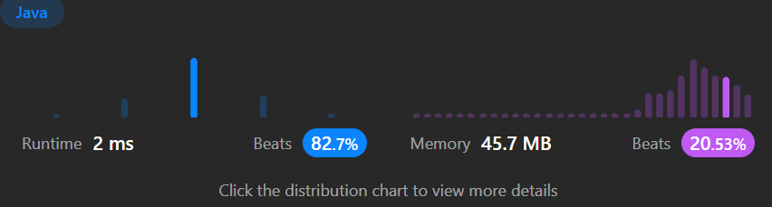

```java
   public class Solution {
    public int minPathSum(int[][] grid) {
        int m = grid.length;
        int n = grid[0].length;

        // 첫번째 row는 오른쪽으로만 이동할 수 있기 때문에, 각 cell은 왼쪽 cell의 값과 현재 cell의 값을 더한 값
        for(int i = 1; i < n; i++)
            grid[0][i] += grid[0][i-1];

        // 첫번째 column은 아래로만 이동할 수 있기 때문에, 각 cell은 위의 cell의 값과 현재 cell의 값을 더한 값
        for(int i = 1; i < m; i++)
            grid[i][0] += grid[i-1][0];

        // 나머지 cell들은 왼쪽 또는 위쪽 cell의 값 중 작은 값과 현재 cell의 값을 더한 값
        // 이렇게 하면, 각 cell에서의 최소 경로 합을 계산
        for(int i = 1; i < m; i++) {
            for(int j = 1; j < n; j++) {
                grid[i][j] += Math.min(grid[i-1][j], grid[i][j-1]);
            }
        }

        // 마지막 cell의 값이 최소 경로의 합. 그 값을 반환
        return grid[m-1][n-1];
    }
}
```