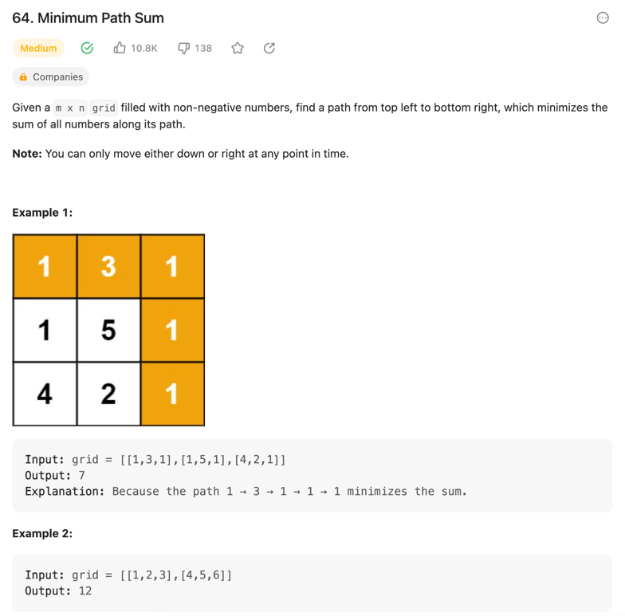
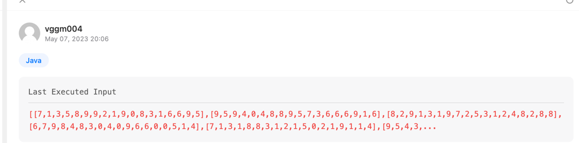

> https://leetcode.com/problems/minimum-path-sum/description/

~~~java
class Solution {
    public int minPathSum(int[][] grid) {

        for (int i = 0; i < grid.length; i++) {
            for (int j = 0; j < grid[0].length; j++) {
                if (i > 0 || j > 0) {
                    grid[i][j] += Math.min(
                            j > 0 ? grid[i][j - 1] : Integer.MAX_VALUE,
                            i > 0 ? grid[i - 1][j] : Integer.MAX_VALUE
                    );
                }
            }
        }

        return grid[grid.length - 1][grid[0].length - 1];
    }
}
~~~

---

~~~java
class Solution {
    public int minPathSum(int[][] grid) {
        Queue<int[]> queue = new LinkedList<>();
        queue.add(new int[] {0, 0, grid[0][0]});
        int min = Integer.MAX_VALUE;

        while (!queue.isEmpty()) {
            final var path = queue.poll();
            final var rowCheck = path[0] + 1 < grid.length;
            final var colCheck = path[1] + 1 < grid[0].length;

            if (!(rowCheck || colCheck)) {
                min = Math.min(min, path[2]);
            } else if (min < Integer.MAX_VALUE && min > path[2]) {
                continue;
            } else {
                if (rowCheck) queue.add(new int[] {path[0] + 1, path[1], path[2] + grid[path[0] + 1][path[1]]});
                if (colCheck) queue.add(new int[] {path[0], path[1] + 1, path[2] + grid[path[0]][path[1] + 1]});
            }
        }

        return min;
    }
}
~~~