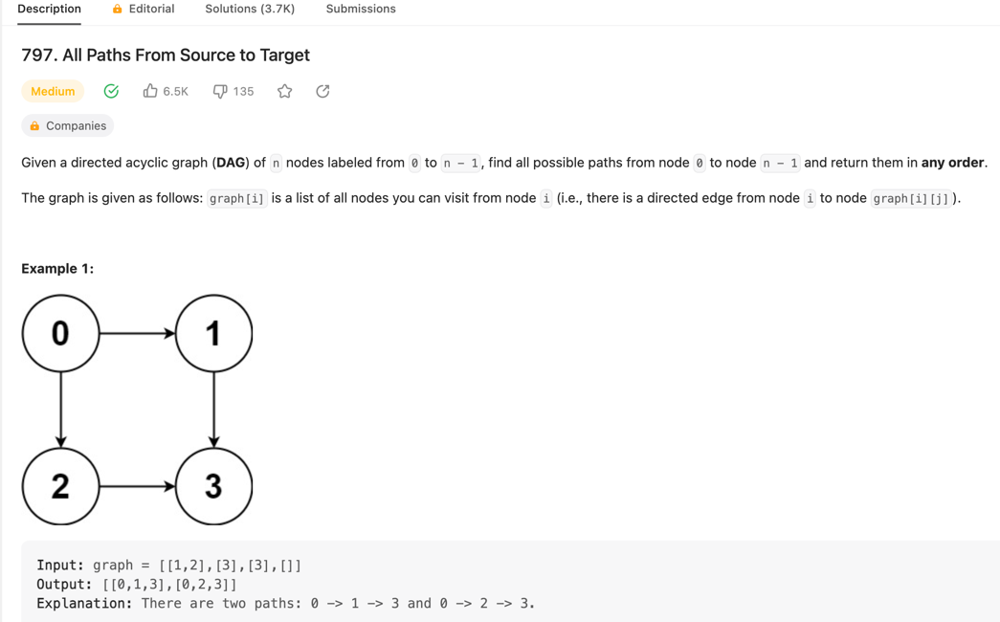
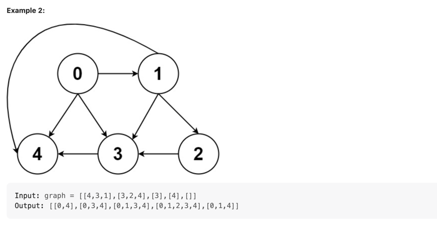
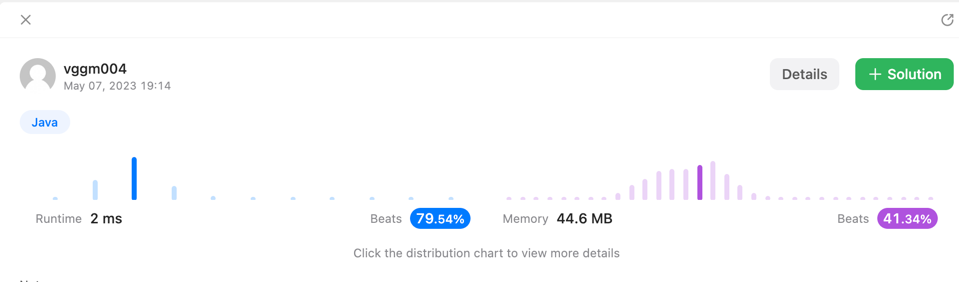
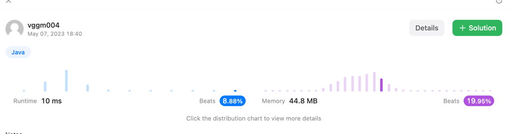

> https://leetcode.com/problems/all-paths-from-source-to-target/description/

~~~java
class Solution {
    public List<List<Integer>> allPathsSourceTarget(int[][] graph) {
        List<List<Integer>> answer = new ArrayList<>();
        final var path = new ArrayList<Integer>();
        path.add(0);

        search(answer, path, graph, 0, graph.length - 1);

        return answer;
    }

    public void search(List<List<Integer>> answer, List<Integer> paths, int[][] graph, int now, int dest) {

        if (now == dest) {
            answer.add(new ArrayList(paths));

            return;
        }

        for (int n : graph[now]) {
            paths.add(n);
            search(answer, paths, graph, n, dest);
            paths.remove(paths.size() - 1);
        }
    }
}
~~~

---

~~~java
class Solution {
    public List<List<Integer>> allPathsSourceTarget(int[][] graph) {
        List<List<Integer>> answer = new ArrayList<>();
        Queue<List<Integer>> queue = new LinkedList<>();
        queue.add(Arrays.asList(0));
        int dest = graph.length -1;

        while (!queue.isEmpty()) {
            final var path = queue.poll();
            final var now = path.get(path.size() - 1); // 마지막 경로 (현재 위치한 노드)

            if (now == dest) {
                answer.add(new ArrayList<>(path));
            } else {

                for (int node : graph[now]) {
                    List<Integer> newPath = new ArrayList<>(path);
                    newPath.add(node);

                    queue.add(newPath);
                }
            }
        }

        return answer;
    }
}
~~~