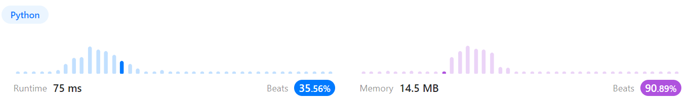

# 문제풀이
## 797. All Paths From Source to Target

### Discription  
요약) 비순환 방향그래프가 주어졌을 때 0에서 마지막까지 도달하는 모든 경로를 반환하라.  
https://leetcode.com/problems/all-paths-from-source-to-target/  

### Solution

```python
from collections import deque

class Solution(object):
    def allPathsSourceTarget(self, graph):
        """
        :type graph: List[List[int]]
        :rtype: List[List[int]]
        """
        
        end_node = len(graph)-1
        res = []
        q = deque([(0, [0])])

        while q:
            node, path = q.popleft()
            
            if graph[node] and node < end_node:
                for nxt in graph[node]:
                    temp = path[:]
                    temp.append(nxt)
                    q.append((nxt, temp))
            else:
                if path[-1] == end_node:
                    res.append(path)

        return res
```
  
첫 노드에서부터 BFS 탐색을 돌린다.  
더이상 연결된 노드가 없거나 현재 노드가 마지막 노드가 아닐 때 연결된 노드들을 큐에 넣는다.  
아닐 경우 지금까지 지나온 경로의 마지막이 마지막 노드일 경우만 결과값에 추가한다.  
BFS탐색이 끝나면 결과값을 반환한다.  

## 64. Minimum Path Sum

### Discription
요약) 양의 정수가 입력된 (m, n) 크기의 2차원 배열이 주어졌을 때, [0][0]에서 [n][m]까지 도달하는 합이 가장 작은 수를 찾아라  
https://leetcode.com/problems/minimum-path-sum/  

### Solution

```python
from collections import deque

class Solution(object):
    def minPathSum(self, grid):
        """
        :type grid: List[List[int]]
        :rtype: int
        """
        max_y = len(grid)
        max_x = len(grid[0])
        dist_map = [[float('inf')] * max_x for _ in range(max_y)]

        q = deque([((0, 0), grid[0][0])])
        dist_map[0][0] = grid[0][0]

        while q:
            pos, dist = q.popleft()
            x = pos[0]
            y = pos[1]
            if x+1 < max_x:
                dist_map[y][x+1] = min(dist_map[y][x+1], grid[y][x+1] + dist)
                q.append(((x+1, y), dist_map[y][x+1]))
            if y+1 < max_y:
                dist_map[y+1][x] = min(dist_map[y+1][x], grid[y+1][x] + dist)
                q.append(((x, y+1), dist_map[y+1][x]))

        return dist_map[max_y-1][max_x-1]
```
BFS로 다익스트라 알고리즘을 구현한 뒤, 거리가 기록된 배열에서 [n][m]의 값을 반환한다.  
시간초과가 났다.  

```python
class Solution(object):
    def minPathSum(self, grid):
        """
        :type grid: List[List[int]]
        :rtype: int
        """
        max_y = len(grid)
        max_x = len(grid[0])

        for x in range(max_x-1):
            grid[0][x+1] = grid[0][x] + grid[0][x+1]

        for y in range(max_y-1):
            grid[y+1][0] = grid[y][0] + grid[y+1][0]
        
        for y in range(1, max_y):
            for x in range(1, max_x):
                grid[y][x] = min(grid[y][x] + grid[y-1][x], grid[y][x] + grid[y][x-1])

        return grid[max_y-1][max_x-1]
```
  
그래프에서 오른쪽 위 끝, 왼쪽 위 끝으로 가는 방법은 한 가지밖에 없다.  
위 한 줄, 왼쪽 한 줄의 거리를 먼저 구해놓은 뒤  
grid[1][1]부터 (자신의거리 + 위칸), (자신의거리 + 왼쪽칸) 중 작은 값을 써넣는다.
순회가 모두 끝난 후 grid[n][m]을 반환한다.  

