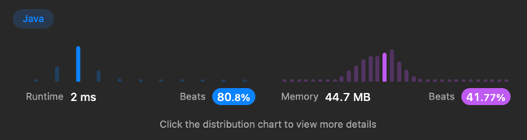

# [All Paths From Source to Target](https://leetcode.com/problems/all-paths-from-source-to-target/)

```java
import java.util.ArrayList;
import java.util.List;

public class AllPathsFromSourcetoTarget {

    public static void main(String[] args) {
        AllPathsFromSourcetoTarget allPathsFromSourcetoTarget = new AllPathsFromSourcetoTarget();

        int[][] grid = {{1, 2}, {3}, {3}, {}};
        int[][] grid2 = {{4, 3, 1}, {3, 2, 4}, {3}, {4}, {}};
        System.out.println(allPathsFromSourcetoTarget.allPathsSourceTarget(grid));
        //System.out.println(allPathsFromSourcetoTarget.allPathsSourceTarget(grid2));
    }

    public List<List<Integer>> allPathsSourceTarget(int[][] graph){
        List<List<Integer>> result = new ArrayList<>();
        dfs(result, new ArrayList<>(), graph, 0, graph.length - 1);
        return result;
    }

    public void dfs(List<List<Integer>> result, List<Integer> route, int[][] graph, int start, int end) {
        //시작노드 무조건 0 삽입
        route.add(start);
        //System.out.println(route+"//"+end);
        if (start == end) { // 종료조건 시작위치 == n - 1
            result.add(new ArrayList<>(route));
        } else {
            for (int node : graph[start]) {//
                //System.out.println(node +".."+graph[start][0]);
                this.dfs(result, route, graph, node, end);
            }
        }
        route.remove(route.size() - 1);
    }
}

```



