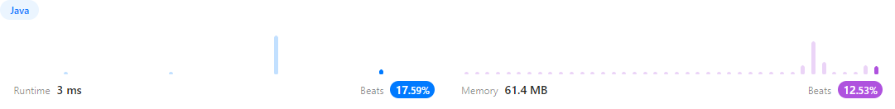

https://leetcode.com/problems/best-time-to-buy-and-sell-stock/

## 풀이

```java
class Solution {
    public int maxProfit(int[] prices) {
			int min=prices[0]; // 0으로 세팅하면 무조건 가장 작은값이 0이 되므로
			int max=0;
			for(int i = 1; i < prices.length; i++){
				min=Math.min(min,prices[i]); // 작은 값 세팅
				max=Math.max(max,prices[i]-min); // 큰 값 세팅
			}
			return max;
    }
}
```
