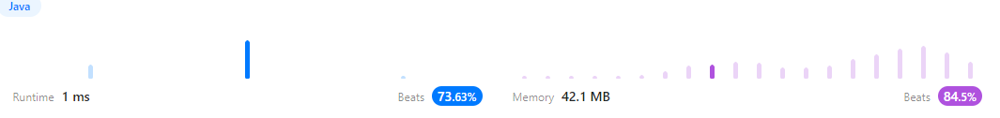

## 풀이


```java
class Solution {
   public List<List<Integer>> subsets(int[] nums) {
      List<List<Integer>> answer = new ArrayList<List<Integer>>();
      List<Integer> list = new ArrayList<Integer>();
      dfs(nums, 0, list, answer);
      return answer;
   }

   public void dfs(int[] nums, int start, List<Integer> list, List<List<Integer>> answer){
      if (start == nums.length){ // nums가 다 포함되면 재귀 탈출
         answer.add(new ArrayList<>(list));
         return;
      }

      list.add(nums[start]);// start index 값 리스트에 추가
      dfs(nums, start+1, list, answer); // 후 재귀 호출
      list.remove(list.size()-1); // 재귀가 다 끝난 후 이전 단계까지 예 1,2 후 3 까지 올수 있도록

      dfs(nums, start+1, list, answer); // nums[start]에 포함되지 않는 경우 재귀
   }
}
```
