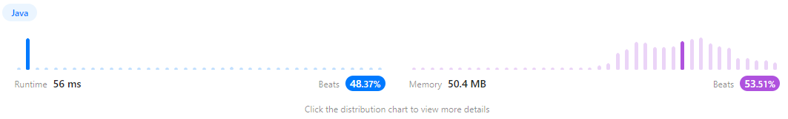

https://leetcode.com/problems/3sum/

## 풀이

```java
class Solution {
    public List<List<Integer>> threeSum(int[] nums) {
        Arrays.sort(nums);//오름차순 정렬
        Set<List<Integer>> result = new HashSet<>();
        int left = 0;
        int right = 0;
        for (int i = 0; i < nums.length - 2; i++) { // 3sum이므로 최소 3개의 값은 필요로 함으로 -2까지만 반복
            if (i > 0 && nums[i] == nums[i - 1]) {
                continue; // 이미 한 값(중복)제외
            }
            left = i + 1;
            right = nums.length - 1;
            while (left < right) {
                int sum = nums[i] + nums[left] + nums[right];
                if (sum == 0) {
                    result.add(Arrays.asList(nums[i], nums[left], nums[right]));
                    left++;
                    right--;
                } else if (sum < 0) {
                    left++;
                } else {
                    right--;
                }
            }
        }
        return new ArrayList<>(result);
    }
}
```
