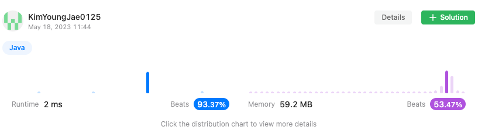

<h2><a href="https://leetcode.com/problems/best-time-to-buy-and-sell-stock/">121. Best Time to Buy and Sell Stock</a></h2><h3>Easy</h3><hr><div><p>You are given an array <code>prices</code> where <code>prices[i]</code> is the price of a given stock on the <code>i<sup>th</sup></code> day.</p>

<p>You want to maximize your profit by choosing a <strong>single day</strong> to buy one stock and choosing a <strong>different day in the future</strong> to sell that stock.</p>

<p>Return <em>the maximum profit you can achieve from this transaction</em>. If you cannot achieve any profit, return <code>0</code>.</p>

<p>&nbsp;</p>
<p><strong class="example">Example 1:</strong></p>

<pre><strong>Input:</strong> prices = [7,1,5,3,6,4]
<strong>Output:</strong> 5
<strong>Explanation:</strong> Buy on day 2 (price = 1) and sell on day 5 (price = 6), profit = 6-1 = 5.
Note that buying on day 2 and selling on day 1 is not allowed because you must buy before you sell.
</pre>

<p><strong class="example">Example 2:</strong></p>

<pre><strong>Input:</strong> prices = [7,6,4,3,1]
<strong>Output:</strong> 0
<strong>Explanation:</strong> In this case, no transactions are done and the max profit = 0.
</pre>

<p>&nbsp;</p>
<p><strong>Constraints:</strong></p>

<ul>
	<li><code>1 &lt;= prices.length &lt;= 10<sup>5</sup></code></li>
	<li><code>0 &lt;= prices[i] &lt;= 10<sup>4</sup></code></li>
</ul>
</div>

## 풀이

```java
// 최대 이익을 구하는 문제
public int maxProfit(int[] prices) {
    int max = 0
      , min = Integer.MAX_VALUE;
    for(int i=0, len=prices.length; i<len; i++) {
        if(prices[i] < min) {
            min = prices[i];
            continue;
        }
        int sub = prices[i] - min;
        if(max < sub) max = sub;
    }
    return max;
}
```



## 풀이 방법
1. 최대값을 담을 `max(초기값 0)`, 과 최소값을 담을 `min(int 최대값)` 생성
2. `prices.length` 만큼 반복
3. `prices[현재 인덱스]` 값이 `min` 변수보다 작을 경우 `min` 변수의 값을 `prices[현재 인덱스]` 값으로 변경
4. `prices[현재 인덱스]` 값 - `min`의 값이 `max` 값보다 클 경우(최대 이익을 얻을 수 있는 값) 해당 계산 값을 `max` 변수의 갑승로 변경
5. 반복문이 끝나면 `max` 변수 반환