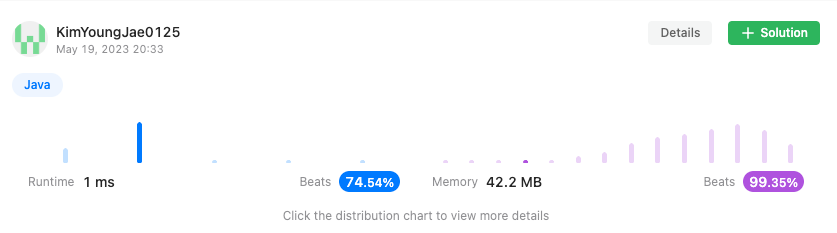

<h2><a href="https://leetcode.com/problems/subsets/">78. Subsets</a></h2><h3>Medium</h3><hr><div><p>Given an integer array <code>nums</code> of <strong>unique</strong> elements, return <em>all possible</em> <span data-keyword="subset"><em>subsets</em></span> <em>(the power set)</em>.</p>

<p>The solution set <strong>must not</strong> contain duplicate subsets. Return the solution in <strong>any order</strong>.</p>

<p>&nbsp;</p>
<p><strong class="example">Example 1:</strong></p>

<pre><strong>Input:</strong> nums = [1,2,3]
<strong>Output:</strong> [[],[1],[2],[1,2],[3],[1,3],[2,3],[1,2,3]]
</pre>

<p><strong class="example">Example 2:</strong></p>

<pre><strong>Input:</strong> nums = [0]
<strong>Output:</strong> [[],[0]]
</pre>

<p>&nbsp;</p>
<p><strong>Constraints:</strong></p>

<ul>
	<li><code>1 &lt;= nums.length &lt;= 10</code></li>
	<li><code>-10 &lt;= nums[i] &lt;= 10</code></li>
	<li>All the numbers of&nbsp;<code>nums</code> are <strong>unique</strong>.</li>
</ul>
</div>

## 풀이


```java
// 주어진 nums 배열로 만들 수 있는 모든 경우의 수 구하기
public List<List<Integer>> subsets(int[] nums) {
    List<List<Integer>> result = new ArrayList<>();
    result.add(new ArrayList<>());
    for(int i = 0, length = nums.length; i < length; i++) {
        dfs(result, new ArrayList<>(), nums, i, length);
    }
    return result;
}
void dfs(List<List<Integer>> result, List<Integer> list, int[] nums, int index, int length) {
    list.add(nums[index]);
    result.add(new ArrayList<>(list));
    for(int i = index + 1; i < length; i++) {
        dfs(result, list, nums, i, length);
        list.remove(list.indexOf(nums[i]));
    }
}
```



## 풀이 방법

1. `List` 타입인 `result` 변수 생성
2. `result` 변수에 빈 List 값을 추가
3. 모든 값을 다 담아야하기 때문에 `nums.length` 길이 만큼 반복
4. `dfs` 메소드 실행
   - `dfs` `nums[인자값 인덱스]`를 `list` 변수에 추가
   - 해당 `list` 변수를 깊은 복사하여 `result`변수에 추가
   - 인자값 인덱스에서 1을 더한 값부터 `nums.length` 길이만큼 반복하여 `dfs` 메소드 실행(인자값 인덱스에서 모든 경우의 수를 만들어야 하기 때문)
   - `nums[현재 인덱스(변수 i)]` 값을 `list` 변수에서 제거
   - 반복
5. 만들어진 result 값을 반환