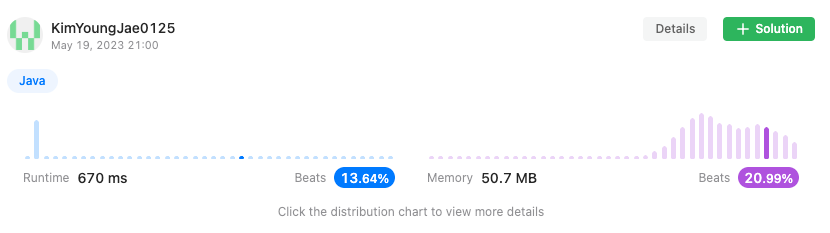

<h2><a href="https://leetcode.com/problems/3sum/">15. 3Sum</a></h2><h3>Medium</h3><hr><div><p>Given an integer array nums, return all the triplets <code>[nums[i], nums[j], nums[k]]</code> such that <code>i != j</code>, <code>i != k</code>, and <code>j != k</code>, and <code>nums[i] + nums[j] + nums[k] == 0</code>.</p>

<p>Notice that the solution set must not contain duplicate triplets.</p>

<p>&nbsp;</p>
<p><strong class="example">Example 1:</strong></p>

<pre><strong>Input:</strong> nums = [-1,0,1,2,-1,-4]
<strong>Output:</strong> [[-1,-1,2],[-1,0,1]]
<strong>Explanation:</strong> 
nums[0] + nums[1] + nums[2] = (-1) + 0 + 1 = 0.
nums[1] + nums[2] + nums[4] = 0 + 1 + (-1) = 0.
nums[0] + nums[3] + nums[4] = (-1) + 2 + (-1) = 0.
The distinct triplets are [-1,0,1] and [-1,-1,2].
Notice that the order of the output and the order of the triplets does not matter.
</pre>

<p><strong class="example">Example 2:</strong></p>

<pre><strong>Input:</strong> nums = [0,1,1]
<strong>Output:</strong> []
<strong>Explanation:</strong> The only possible triplet does not sum up to 0.
</pre>

<p><strong class="example">Example 3:</strong></p>

<pre><strong>Input:</strong> nums = [0,0,0]
<strong>Output:</strong> [[0,0,0]]
<strong>Explanation:</strong> The only possible triplet sums up to 0.
</pre>

<p>&nbsp;</p>
<p><strong>Constraints:</strong></p>

<ul>
	<li><code>3 &lt;= nums.length &lt;= 3000</code></li>
	<li><code>-10<sup>5</sup> &lt;= nums[i] &lt;= 10<sup>5</sup></code></li>
</ul>
</div>

## 풀이

```java
public List<List<Integer>> threeSum(int[] nums) {
    Set<List<Integer>> result = new HashSet<>();
    Arrays.sort(nums);
    for(int i=0, length=nums.length - 2; i < length; i++) {
        int left = i + 1;
        int right = length + 1;
        while(left < right) {
            int sum = nums[i] + nums[left] + nums[right];
            if(sum == 0) result.add(Arrays.asList(nums[i], nums[left++], nums[right--]));
            else if(sum < 0) left++;
            else right--;
        }
    }
    return new ArrayList<>(result);
}
```



```java
// 주어진 nums의 값 3개의 조합 중 합이 0이 나오는 조합 구하기(중복 제외)
public List<List<Integer>> threeSum(int[] nums) {
    Set<List<Integer>> result = new HashSet<>();
    Arrays.sort(nums);
    for(int i=0, length=nums.length - 2; i < length; i++) {
        int left = i + 1;
        int right = length + 1;
        while(left < right) {
            int sum = nums[i] + nums[left] + nums[right];
            if(sum == 0) {
                List<Integer> list = new ArrayList<>();
                list.add(nums[i]);
                list.add(nums[left++]);
                list.add(nums[right--]);
                result.add(list);
            }
            else if(sum < 0) left++;
            else right--;
        }
    }
    return new ArrayList<>(result);
}
```


### 풀이 방법
1. 중복 된 숫자 리스트를 제거하기 위해 Set 자료 구조 이용한 `result` 변수 생성
2. 인수로 주어진 nums 배열 정렬
3. `nums.length - 2` 길이 만큼 반복
4. `int` 타입 변수 두 개 생성 `left(현재 인덱스 + 1)`, `right(nums.length - 1)`
5. `left` 변수가 `right` 변수보다 값이 커질때까지 반복
6. `nums[현재 인덱스]`, `nums[left 값]`, `nums[right 값]`의 값을 더 한 값을 담은 `sum` 변수 생성
7. 만약 `sum` 값이 0일 경우 `nums[현재 인덱스]`, `nums[left 값]`, `nums[right 값]`을 리스트에 담아 미리 생성해놓은 `result` 변수에 추가
   - 담을 때 left의 값을 1 올리고 right의 값을 1 내린다.
8. 만약 `sum` 값이 0보다 작을 경우 `left` 변수 값을 1 올린다
   - 왜냐하면 2번에서 정렬을 하였기 때문에 0보다 작을 경우 `left` 인덱스를 올려줘야 0 이상의 값을 얻을 수 있기 때문
9. 만약 `sum` 값이 0보다 클 경우 `right` 변수 값을 1 내린다
   - 왜냐하면 2번에서 정렬을 하였기 때문에 0보다 작을 경우 `right` 인덱스를 내려줘야 0 이하의 값을 얻을 수 있기 때문
10. 최종적으로 만들어진 `result` 값을 반환 타입인 `List`로 만들어 값을 반환한다. 