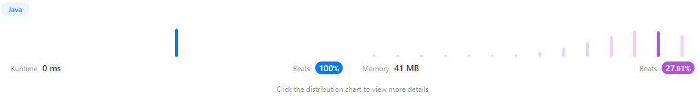

https://leetcode.com/problems/climbing-stairs/
중위순회

```java
/**
 * Definition for a binary tree node.
 * public class TreeNode {
 *     int val;
 *     TreeNode left;
 *     TreeNode right;
 *     TreeNode() {}
 *     TreeNode(int val) { this.val = val; }
 *     TreeNode(int val, TreeNode left, TreeNode right) {
 *         this.val = val;
 *         this.left = left;
 *         this.right = right;
 *     }
 * }
 */
class Solution {
    public List<Integer> inorderTraversal(TreeNode root) {
        List<Integer> result = new ArrayList<>();
        inorder(root, result); // 중위순회
        return result;
    }

    private void inorder(TreeNode node, List<Integer> result) {
        if (node == null) {
            return; // 노드가 null이면 종료
        }

        inorder(node.left, result); // 왼쪽 서브트리 순회
        result.add(node.val); // 현재 노드의 값을 결과 리스트에 추가
        inorder(node.right, result); // 오른쪽 서브트리 순회
    }
}
```


