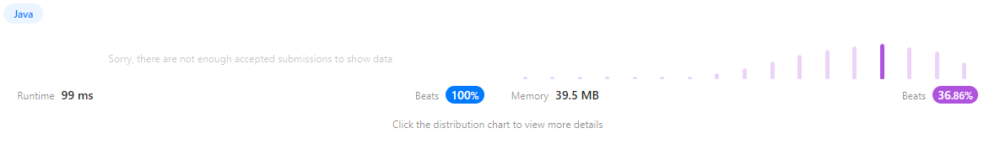

https://leetcode.com/problems/binary-tree-inorder-traversal/

계단 오르는 방법

```java
class Solution {
    public int climbStairs(int n) {
        if (n <= 2) {
            return n; // n이 2 이하인 경우, 계단의 수와 동일한 값 반환
        }

        int[] answer =  new int[n];
        answer[0] = 1; // 첫번째 계단 오르는 방법 1개
        answer[1] = 2; // 두번째 계단 오르는 방법 2개  = {1,1} , {2}

        for(int i=2;i<n;i++){ // 세번째부터는 반복
            answer[i] = answer[i-1] + answer[i-2];
        }

        return answer[n-1];
    }
}
```

