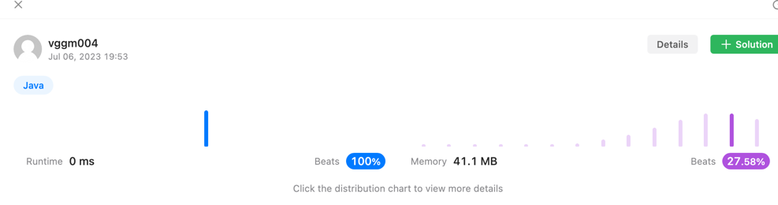

> https://leetcode.com/problems/binary-tree-inorder-traversal/description/

---
~~~java
/**
 * Definition for a binary tree node.
 * public class TreeNode {
 *     int val;
 *     TreeNode left;
 *     TreeNode right;
 *     TreeNode() {}
 *     TreeNode(int val) { this.val = val; }
 *     TreeNode(int val, TreeNode left, TreeNode right) {
 *         this.val = val;
 *         this.left = left;
 *         this.right = right;
 *     }
 * }
 */
class Solution {
    List<Integer> answer = new ArrayList<>();
    public List<Integer> inorderTraversal(TreeNode root) {
        search(root);

        return answer;
    }

    public void search(TreeNode node) {
        if (node != null) {
                search(node.left);
                answer.add(node.val);
                search(node.right);
        }
    }
}
~~~