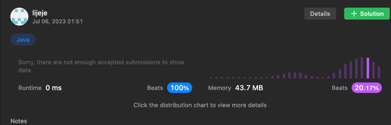
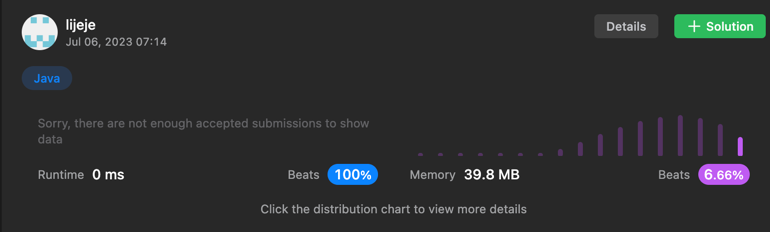

# 35번
```java
package Main.leetcode;

public class SearchInsertPosition35 {
    public static void main(String[] args) {
        SearchInsertPosition35 test = new SearchInsertPosition35();
        int[] nums = {1};
        int target = 2;
        System.out.println(test.searchInsert(nums,target));
    }

    private int searchInsert(int[] nums, int target){
        int i=0;
        for(i=0; i<nums.length;i++){
            if(nums[i] >= target) {
                return i;
            }
        }
        return i;
    }
}

```


# 70번
```java
public class ClimbingStairsJava70 {
    public static void main(String[] args) {
        ClimbingStairsJava70 test = new ClimbingStairsJava70();
        System.out.println(test.climbStairs(5));
    }

    private int climbStairs(int n){
        // int a = n/2;
        // int b = n%2;
        // int result = (a*2)+b;
        // return result; 
        
        int dp[] = new int[n+2];
        dp[1] = 1;
        dp[2] = 2;

        for(int i=3;i<=n;i++){
            dp[i] = dp[i-1] + dp[i-2];
        }
        return dp[n];
    }
}
```


# 94번
```java
import java.util.ArrayList;
class Solution {
    List<Integer> list;
    public List<Integer> inorderTraversal(TreeNode root) {
        list = new ArrayList<Integer>();
        inorder(root);
        return list;
    }
    
    public void inorder(TreeNode node) {
        if(node != null) {
            if(node.left != null) inorder(node.left);
            list.add(node.val);
            if(node.right != null) inorder(node.right);
        }  
    }
}
```

