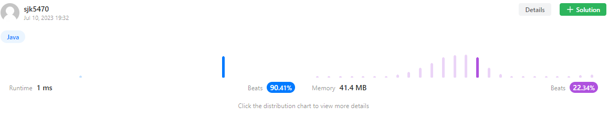

https://leetcode.com/problems/pascals-triangle/

부모 노드의 합산

```java
class Solution {
    public List<List<Integer>> generate(int numRows) {
        List<List<Integer>> answer = new ArrayList<>();
        
        if (numRows > 0) {
            answer.add(Arrays.asList(1));// 첫 번째 행은 항상 1로 시작하므로, 1 추가
            
            for (int i = 1; i < numRows; i++) {
                List<Integer> row = new ArrayList<>();// 현재 행을 구성하는 숫자들을 저장할 리스트를 생성
                
                row.add(1);// 각 행의 첫 번째 숫자는 항상 1
                
                for (int j = 1; j < i; j++) { // 이전 행의 숫자를 조합하여 현재 행의 숫자를 생성
                    int num = answer.get(i - 1).get(j - 1) + answer.get(i - 1).get(j);
                    row.add(num);
                }
                
                row.add(1);// 각 행의 마지막 숫자는 항상 1입니다.
                
                answer.add(row);// 현재 행을 결과 리스트에 추가합니다.
            }
        }
        
        return answer;
    }
}
```
