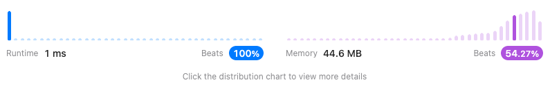

<h2><a href="https://leetcode.com/problems/single-number/">136. Single Number</a></h2><h3>Easy</h3><hr><div><p>Given a <strong>non-empty</strong>&nbsp;array of integers <code>nums</code>, every element appears <em>twice</em> except for one. Find that single one.</p>

<p>You must&nbsp;implement a solution with a linear runtime complexity and use&nbsp;only constant&nbsp;extra space.</p>

<p>&nbsp;</p>
<p><strong class="example">Example 1:</strong></p>
<pre><strong>Input:</strong> nums = [2,2,1]
<strong>Output:</strong> 1
</pre><p><strong class="example">Example 2:</strong></p>
<pre><strong>Input:</strong> nums = [4,1,2,1,2]
<strong>Output:</strong> 4
</pre><p><strong class="example">Example 3:</strong></p>
<pre><strong>Input:</strong> nums = [1]
<strong>Output:</strong> 1
</pre>
<p>&nbsp;</p>
<p><strong>Constraints:</strong></p>

<ul>
	<li><code>1 &lt;= nums.length &lt;= 3 * 10<sup>4</sup></code></li>
	<li><code>-3 * 10<sup>4</sup> &lt;= nums[i] &lt;= 3 * 10<sup>4</sup></code></li>
	<li>Each element in the array appears twice except for one element which appears only once.</li>
</ul>
</div>

## Solution

```java
class Solution {
    public int singleNumber(int[] nums) {
        int result = 0;
        for(int num : nums) result ^= num;           
        return result;
    }
}
```



```java
class Solution {
    public int singleNumber(int[] nums) {
        return Arrays.stream(nums).reduce(0, (x,y) -> x ^ y);
    }
}
```

```
xor 연산
비트 연산 서로 다른 비트일 경우 1 같은 비트일 경우 0으로 연산

예시 1
2의 비트 : 00000000 00000000 00000000 00000010
1의 비트 : 00000000 00000000 00000000 00000001

2 ^ 1 = 3
00000000 00000000 00000000 00000010 
^
00000000 00000000 00000000 00000001 
===================================
00000000 00000000 00000000 00000011

3의 비트 : 00000000 00000000 00000000 00000011

여기서 한 번 더 1을 xor 연산을 할 경우

00000000 00000000 00000000 00000011
^
00000000 00000000 00000000 00000001
===================================
00000000 00000000 00000000 00000010
3 ^ 1 = 2

예시 2
 5의 비트 : 00000000 00000000 00000000 00000101
12의 비트 : 00000000 00000000 00000000 00001100

5 ^ 12 = 9
00000000 00000000 00000000 00000101
^
00000000 00000000 00000000 00001100
===================================
00000000 00000000 00000000 00001001
```

