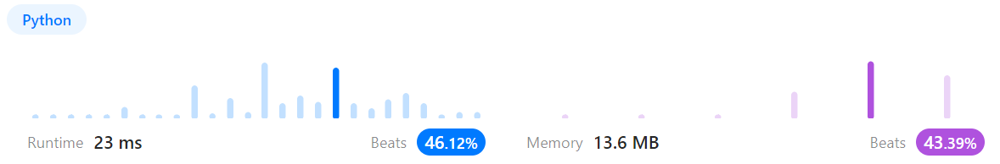
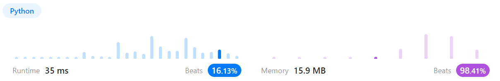
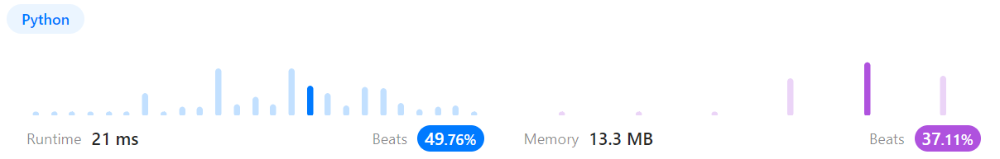

# 문제풀이
## 101. Symmetric Tree

### Discription  
요약) 트리의 루트 노드가 주어졌을 때, 트리가 좌우대칭인지 구하라  
https://leetcode.com/problems/symmetric-tree/description/  

### Solution

```python
# Definition for a binary tree node.
# class TreeNode(object):
#     def __init__(self, val=0, left=None, right=None):
#         self.val = val
#         self.left = left
#         self.right = right
class Solution(object):
    def __init__(self):
        self.ltree = []
        self.rtree = []

    def isSymmetric(self, root):
        """
        :type root: TreeNode
        :rtype: bool
        """
        self.ldfs(root.left, self.ltree)
        self.rdfs(root.right, self.rtree)

        return self.ltree == self.rtree
        
    def ldfs(self, node, history):
        if node:
            history.append(node.val)
            self.ldfs(node.left, history)
            self.ldfs(node.right, history)
        else:
            history.append(None)

    def rdfs(self, node, history):
        if node:
            history.append(node.val)
            self.rdfs(node.right, history)
            self.rdfs(node.left, history)
        else:
            history.append(None)
```
  
루트의 왼쪽 노드, 오른쪽 노드를 각각 루트 노드로 순회시킨 뒤  
두 순회가 동일한지 확인한다.  
이 때 순회 순서를 반대로 하고  
노드가 null인 경우도 체크하기 위해 리스트에 null도 삽입한다.  

## 104. Maximum Depth of Binary Tree

### Discription
요약) 이진 트리의 최대 깊이를 구하라    
https://leetcode.com/problems/maximum-depth-of-binary-tree/description/  

### Solution

```python
# Definition for a binary tree node.
# class TreeNode(object):
#     def __init__(self, val=0, left=None, right=None):
#         self.val = val
#         self.left = left
#         self.right = right
class Solution(object):
    def maxDepth(self, root):
        """
        :type root: TreeNode
        :rtype: int
        """
        depth = 0

        if not root:
            return depth

        queue = [root]
        while queue:
            depth += 1
            for _ in range(len(queue)):
                node = queue.pop(0)
                if node.left:
                    queue.append(node.left)
                if node.right:
                    queue.append(node.right)
        
        return depth
```
  
BFS를 이용해 레벨 순회를 돌리며 최대 깊이를 구했다.  

## 118. Pascal's Triangle

### Discription
요약) 파스칼 삼각형의 행 개수가 주어졌을 때, 파스칼 삼각형에 들어가는 요소를 리스트로 반환하라  
https://leetcode.com/problems/pascals-triangle/description/  

### Solution

```python
class Solution(object):
    def generate(self, numRows):
        """
        :type numRows: int
        :rtype: List[List[int]]
        """
        out = [[1]]
        if numRows == 1:
            return out
            
        out.append([1, 1])
        if numRows == 2:
            return out

        for row in range(3, numRows+1):
            temp = [1]
            for i in range(row-2):
                temp.append(out[-1][i] + out[-1][i+1])
            temp.append(1)
            out.append(temp)

        return out
```
  
실제로 파스칼 삼각형을 계산하는 과정을 구현했다.  
한 층을 구하기 위해 이전 층의 합으로 리스트를 구하고 양 옆에 1을 붙였다.  
