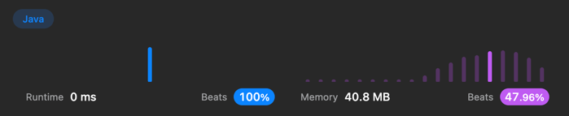
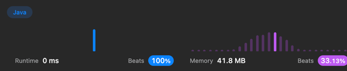
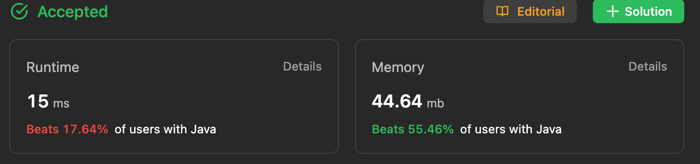

# 101. Symmetric Tree

```java
class Solution {
    public boolean isSymmetric(TreeNode root) {
        if(root == null) return true; //트리가 널인지 체크
        return checkEqual(root.left,root.right);
    }

    public boolean checkEqual(TreeNode left, TreeNode right){
        if(left == null && right == null) return true; //대칭이므로 왼쪽과 오른쪽이 같이 null이면 true
        if(left == null || right == null) return false; // 
        if(left.val != right.val){
            return false;
        }
        return checkEqual(left.left,right.right) && checkEqual(left.right,right.left);
    }
}
```


# 104. Maximum Depth of Binary Tree

```java
class Solution {
    public int maxDepth(TreeNode root) {
        //재귀로 구현
        return getDepth(root, 0);
    }

    public int getDepth(TreeNode node, int depth) {
        if(node == null) return depth;

        return Math.max(getDepth(node.left,depth+1), getDepth(node.right,depth+1));
    }
}
```


# 108
```java
class Solution {
    public TreeNode sortedArrayToBST(int[] nums) {
        if(nums.length == 0) return null;
        return makeNewTree(nums,0, nums.length -1);
    }

    public TreeNode makeNewTree(int[] nums, int left, int right){
        if(left > right) return null;// left 인덱스가 right 인덱스보다 크면 자식 노드가 없다는 뜻이므로 null 반환한다.
        int mid = (left + right)/2;
        TreeNode newNd = new TreeNode(nums[mid]);//현재 노드에 가운데 인덱스(mid)의 노드를 할당한다.
        newNd.left = makeNewTree(nums, left, mid - 1);//현재 노드의 왼쪽에는 인덱스 left부터 (mid-1) 사이의 노드를 연결한다.
        newNd.right = makeNewTree(nums, mid + 1, right);//현재 노드의 오른쪽에는 인덱스 (mid+1)부터 right 사이의 노드를 연결한다.
        return newNd;//현재 노드를 반환한다.
    }
}
```


# 136
```java
class Solution {
    public int singleNumber(int[] nums) {
        Stack<Integer> stack = new Stack<Integer>();
        Arrays.sort(nums);
        for(int i=0; i<nums.length; i++){
            if(stack.empty()){
                stack.push(nums[i]);
            } else if (stack.peek() == nums[i]){
                stack.pop();
            }
        }

        return stack.peek();
    }
}
```



^= 요건 뭐지이?
