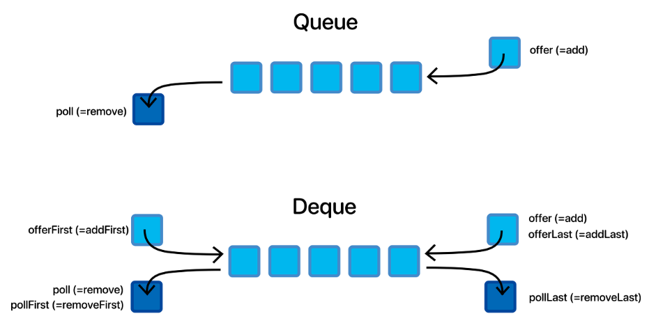
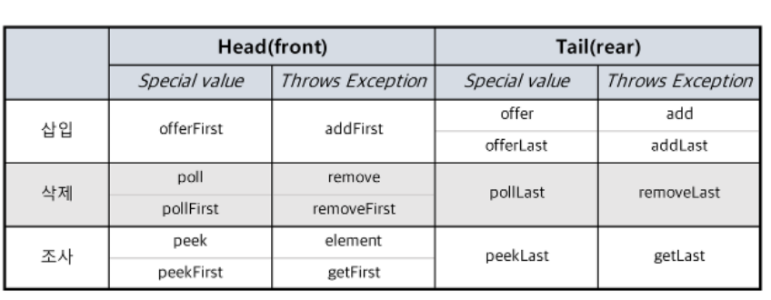
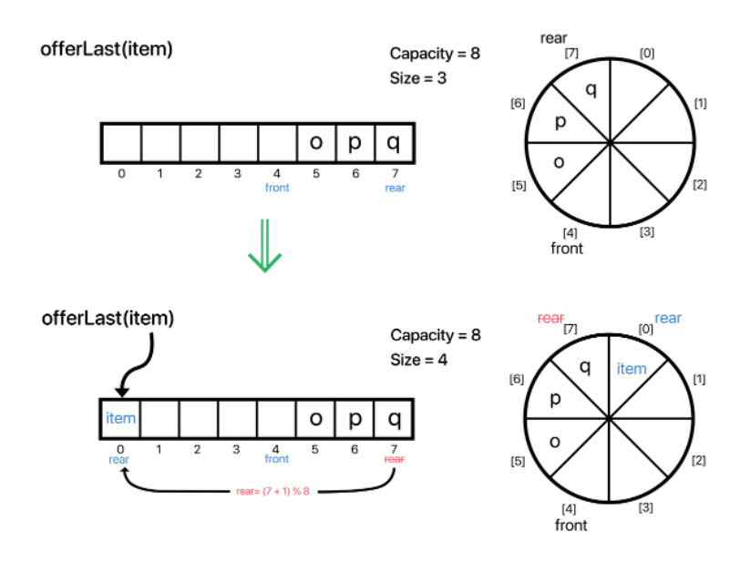
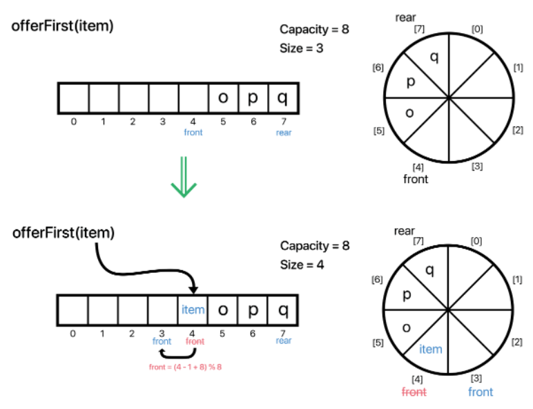
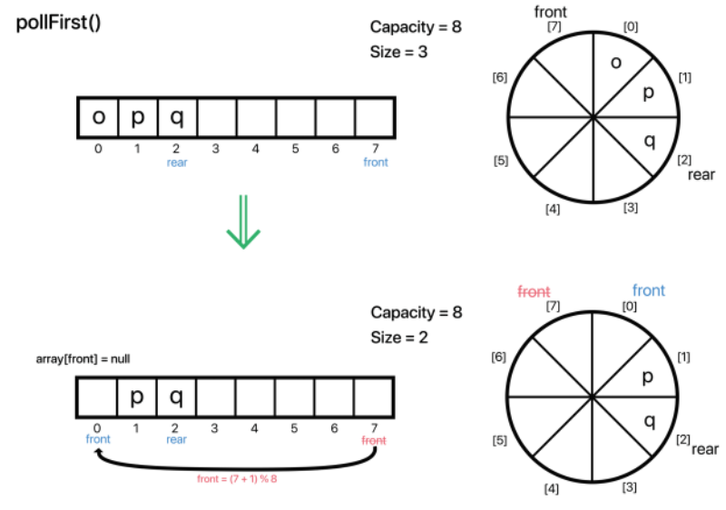
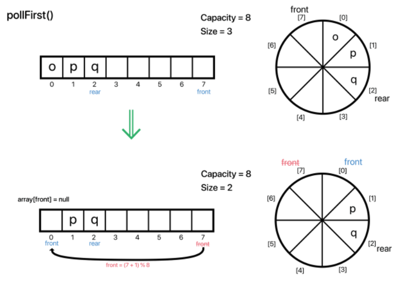
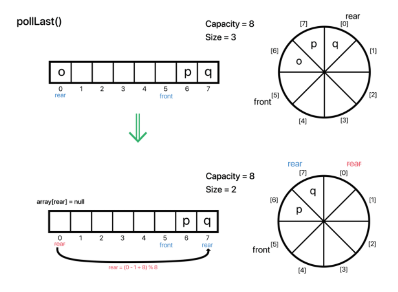

## [JAVA] - 배열을 이용한 Deque(덱) 구현하기
### Deque (using Array)
- 기본적으로 배열을 사용하여 구현되는 자료구조 클래스는 내부에서 최상위 타입 배열인 <B>Object[] 배열을 사용하여 데이털들을 관리</B>하고 있다.
- 그럼 본격적으로 Deque(덱)에 대해 알아보고 구현해야한다.
- 왜 Deque(덱)일까? Deque는 Double-ended queue의 줄임말 이다.  
여기서 오해가 있을 수 있다, 카드게임에서 말하는 덱은 Deck이다, 발음만 같다.
- Queue는 단방향 자료 구조다. 단방향 연결리스트 (SinglyLinkedList)와 유사한 메카니즘이다.
- 반대로 Deque는 양방향 연결리스트 (Doubly LinkedList)와 유사한 메칸티즘이다. 앞서 말한 double-ended, 두 개의 종료 지점이 있다는 것.
한마디로 단 방향으로 삽입 삭제가 이루어진 것에서 양쪽 방향으로 삽입 삭제가 이루어 질 수 있도록 구현된 것이 Deque다.

- 양방향 큐, 즉 덱의 장점이라 하면 스택처럼 사용할 수도 있고 큐처럼 사용할 수도 잇는 자료 구조다.
- deque의 경우 양방향이다보니 메서드들이 헷갈릴 수 있는데, 다음 큐와 비교한 그림을 보며 덱의 구조와 기본적인 메서드의 매칭을 확인해야 한다.

- 위를 보면, Deque는 삽입,삭제 총 12개가 있다.  
offer 계열과 poll계열의 경우 삽입과 삭제 과정에서 저장공간이 넘치거나 삭제 할 원소가 없을 때 특정 (null,false 등)을 반환하지만, add 계열과 remove 계열의 경우 예외를 던진다.  
또한 offer(add)은 offerLast(addLast)와 같고, poll(remove)은 pollFirst(removeFirst)와 같다.  
정리하자면 삽입 삭제에서 구현해야할 것은 크게 4가지다. (add 계열은 이번 구현에서 최대 용적을 제한하지 않을 것이라 빼고 offer 계열만 구현한다.)  

- offerLast, offerFirst, pollFirst, pollLast 만 정확하게 구현한다.  

- 그 외의 peek(element)의 경우 peek(element)은 peekFirst와 같으며, peekLast는 따로 있다. 
-  
- 그리고 기본적으로 ArrayQueue에 몇가지 메서드를 추가하는 것이다. (마찬가지로 원형으로 구현한다.)
- offer()
- 
- offerFirst()
- 
- offer()
- 
- poll()
- 
- pollLast()
- 