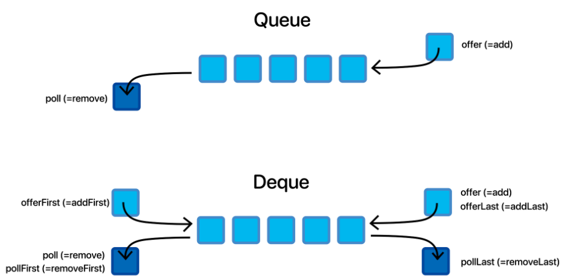
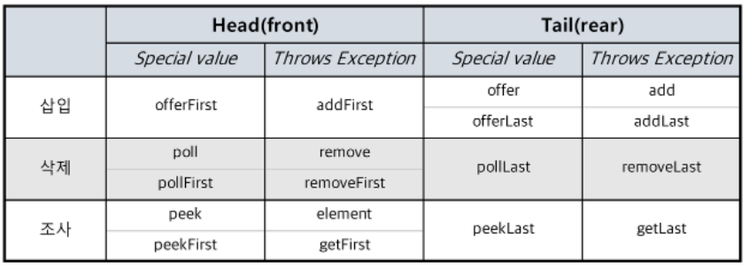
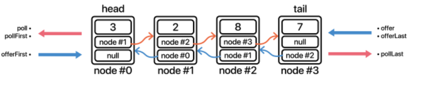
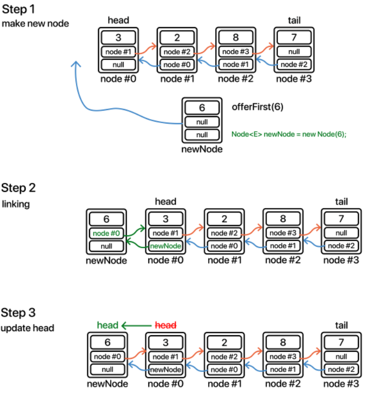
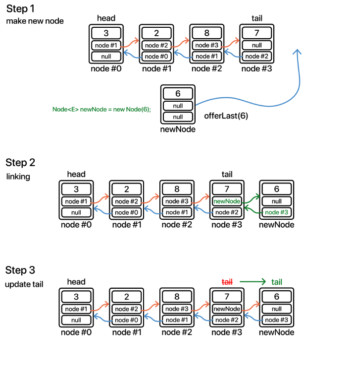
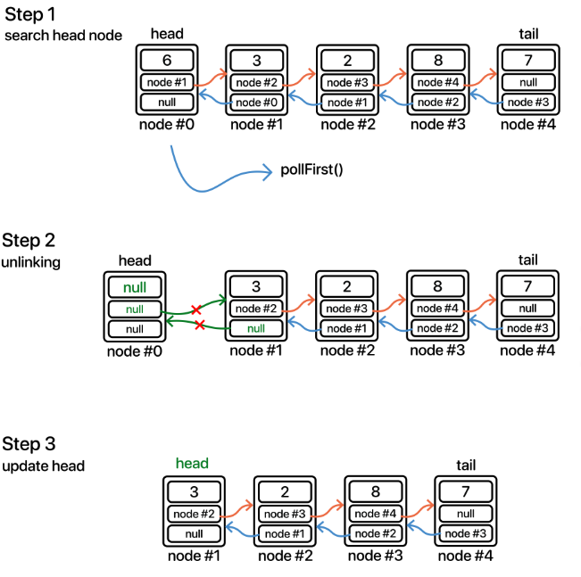
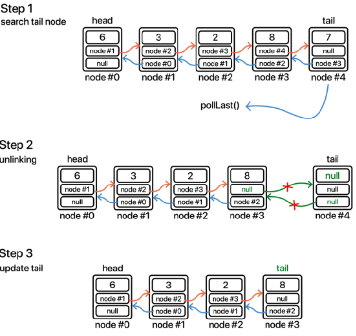

# LinkedList Deque 
- 양방향(이중) 연결리스트에 대한 개념을 그대로 갖고 온다.
- 연결리스트 삽입,삭제는 사용자마다 동작방식이 조금 다르기 때문에 그냥 덱 구현부분을 보면 이해가 어려울 수 있다고 한다.
- Deque는 양방향 연결리스트 ( Doubly LinkedList )와 유사한 메커니즘이다. 앞서 말한 double-ended, 두개의 종료 지점이 있다는 것,
단방향으로 삽입 삭제가 이루어 진 것에서 양쪽 방향으로 삽입 삭제가 이루어 질 수 있도록 구현 한 것이 Deque이다.
- 양방향 큐 즉 덱의 장점이라 하면 스택처럼 사용할 수도 있고 큐 처럼 사용할 수도 있는 자료구조이다.
- Deque의 경우 양방향이다보니 메서드들이 헷갈릴 수 있는데, 다음 큐와 비교한 그림을 보면서 덱의 구조와 기본적인 메서드의 매칭을 잘 알아두도록 하자.
- 
- Deque는 삽입, 삭제 총12개가있다.
  - offer계열과 poll 계열의 경우 삽입과 삭제 과정에서 저장공간이 넘치거나 삭제 할 원소가 없을 때 특정 값(  null,false 등)을 반환하지만 ,
  add계열과 remove 계열의 경우 예외를 던진다.  
  - offer(Add)는 offerLast(addLast)와 같고, poll(remove)은 pollFirst(removeFirst)와 같다.
  - 정리하자면 우리가 삽입 삭제에서 구현해야 할 것은 크게 4가지다.( add 계열은 이번 구현에서 최대 용적을 제한하지 않을 것이기 때문에 빼고 offer 계열만 구현한다.)
- offerLast, offerFirst, pollFirst, pollLast 만 정확하게 구현하면 된다.
- 
- 그냥 배열로 구현한 Deque 와는 어떤 차이점이 있을까?  
  일단 연겨리스트는 index로 관리하는 것이 아닌  node 단위로 구성 된 객체를 서로 연결하여 구성되어 있다.
  그리고 여기서 큐는 단방향이었기 때문에 단일(단방향)연결 리스트를 썼지만 , 이중연결리스트는 양방향 접근 가능한 큐인 만큼 구현의 토대가 되는 연결 리스트 또한 양방향(이중) 연결리스트가 토대가 된다.    
  먼저 단일 연결리스트의 노드와 이중 연결리스트의 노드의 차이를 아래 그림으로 확인 할 수 있다.
- 
- 덱은 양방향을 접근이 가능해야 하기에 당연 이중 연결리스트의 노드를 써야한다.
- 이 노드들을 연결한 형태를 덱 형태로 보자면 이럴 것이다.
-   
- 위와 같이 양 각 노드들은 양 옆의 노드를 서로 참조를 하고 있다. 즉 이중 연결리스트랑 구조가 같다.(사실 당연하다. 리스트를 활용하여 특정 기능의 활용을 크게 분류하여 만들어 진 것 중 하나기 때문이다.)  
그렇기 때문에 기본적으로 ArrayDeque와 구현해야하는 메서드는 동일하고 전반적인 내용 자체도 ArrayDeque와 비슷하다. 
하지만, 구현에 따른 방식은 연결리스트와 거의 같아서 구현에서는 DoublyLinkedList 와 내용이 거의 일치하다.
- offerFirst()
  - 
- offerLast()
  - 
-pollFirst()
  - 
- pollLast ()
  - 