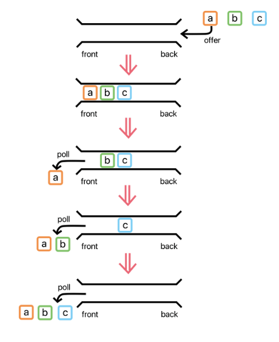
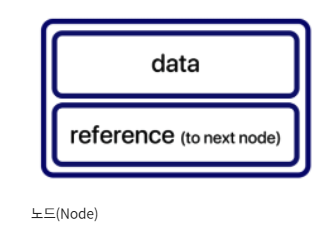
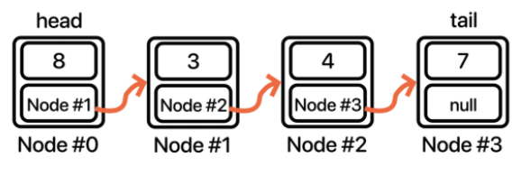
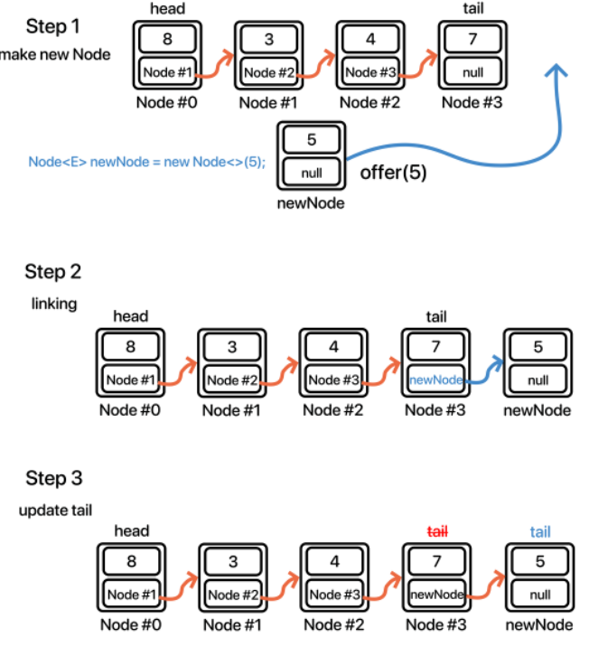
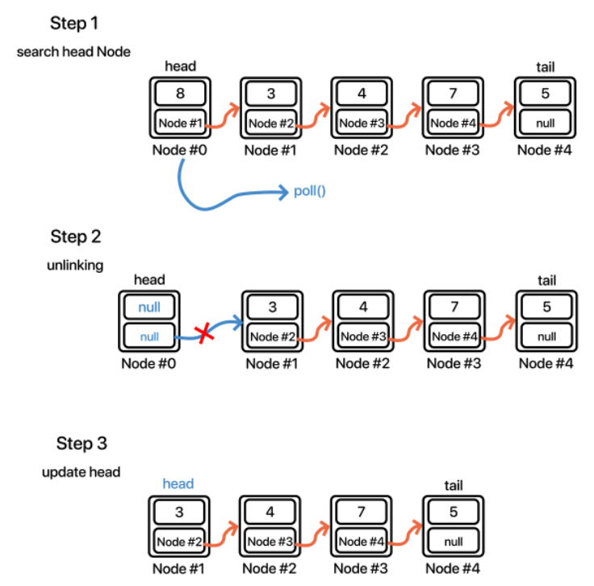

## LinkedListQueue
- 자바에서 Queue라고 한다면
  - ```java
      Queue<Integer> q = new LinkedList<>();
    ```
  자바에서는 큐의 경우 LinkedList로 구현한 큐가 쓰이는 만큼 가장 대중적이고,
    배열로 구현하는 큐에 비해 쉽다.  
    이유는 배열로 구현한 큐의 경우 내부에서 Obejct[] 배열을 담고 있고,  
    요소가 배열에 들어있는 양에 따라 용적(배열크기)을 줄이거나 늘려주어야 하고,
    큐를 선형적인 선형적인 큐로 구현했을 경우 요소들이 뒤로 쏠리기 때문에 이러한 문제를
    해결하고자 원형 형태로 구현하는데 이 구현이 고려해야 할 점도 많고 복잡하다.  
  하지만 배열 대신 연결리스트로 구현하게 될 경우 위와 같은 단점들이 해결된다.  
  각 데이터들을 노드(node)객체에 담고 노드 간 서로 연결해주기 때문에 배열처럼 요소 개수에 따라 늘려주거나 
  줄여줄 필요도 없고 삽입, 삭제 떄는 연결된 링크만 끊어주거나 이어주면 되기 때문에 관리면에서도 편한다.
- Linked List를 이용한 Queue도 마찬가지로 선입선출이 기본 원칙이다.
- 
- 그럼 연결리스트로 구현된 큐는 어떻게 생겼을까 ?  
  - 이번 큐에서 쓰이는 연결 리스트는 단일 연결리스트로 구현하게 된다. 
  - 데이터를 담는 객체 Node라는 객체는 다음과 같은 구성을 갖고 있다.
  - 
  - 그리고 위 노드들을 연결한 형식이 LinkedList(연결리스트)가 되고, 좀 더 세밀하게 말하자면 Singly LinkedList (단일 연결리스트)가 된다. 그리고 그 자체를 갖고 큐의 기능을 넣는 것이다.
  - 
  - 위에서 만약 offer() 메서드를 통해 데이터를 추가 한다고 하면 
  - 
  - 반대로 poll() 메서드를 통해 선입되었던 <B style="color:#995">데이터를 삭제</B> 한다고 하면 다음과 같다.
  - 
  - 위와 같은 형식으로 연결 리스트를 통해 큐(Queue)를 구현하면 되는 것이다.  
  이러한 큐를 보통 'Linked Queue', 'LinkedList-Queue'라고 부른다.  
  해석하자면 "연결형 큐" 또는 "연결리스트 큐" 라고 한다. 어느쪽으로 부르건 상관없고,
  연결형인 것도 맞고 큐를 연결형 자료구조로 LinkedList를 쓰는것도 맞고, LinkedList가 연결형 인것도 맞기 때문이다.  
  보통은 linked list implementation of queue 정도로 말한다.
- offer() 메서드
  - 
- Poll() 메서드
  - 