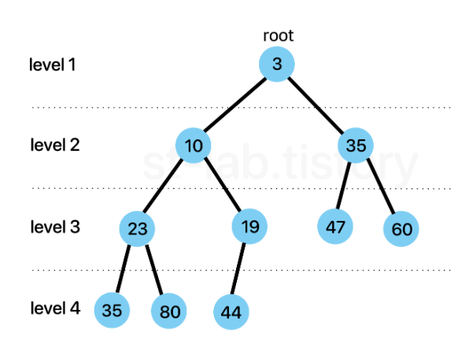
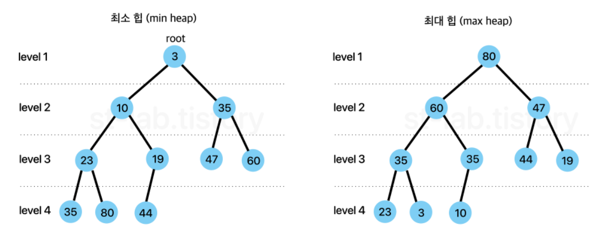
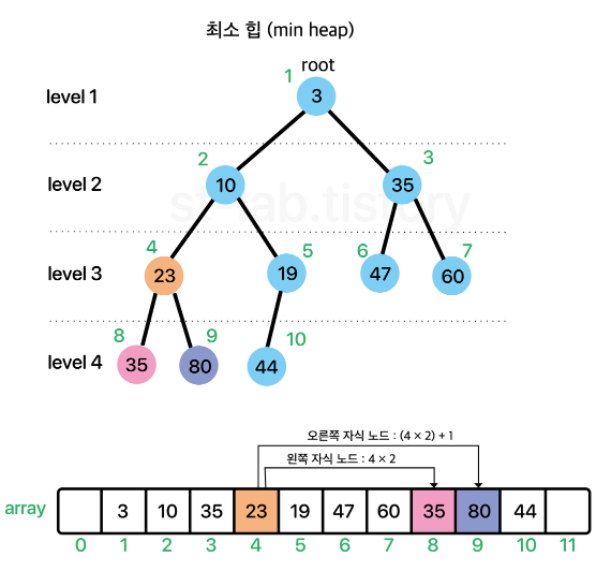
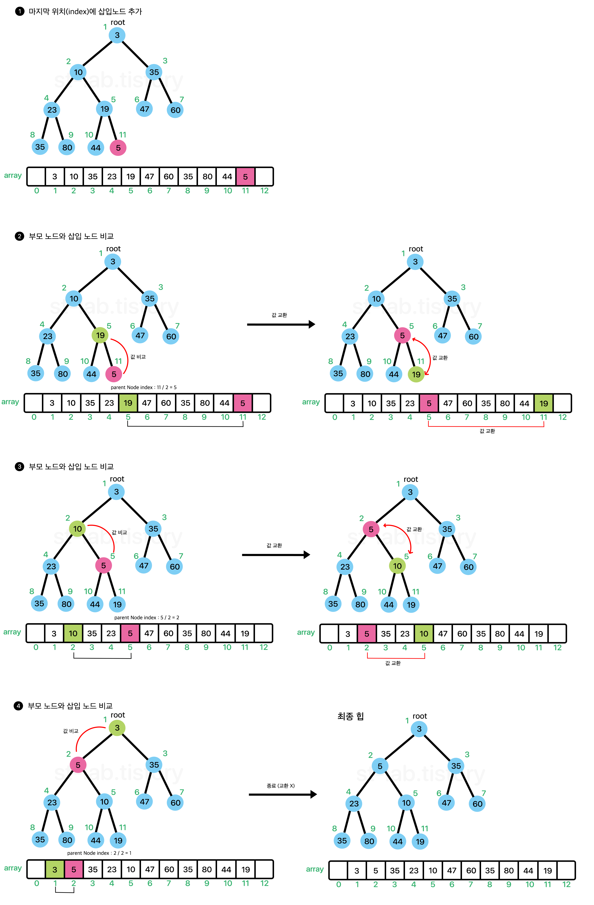
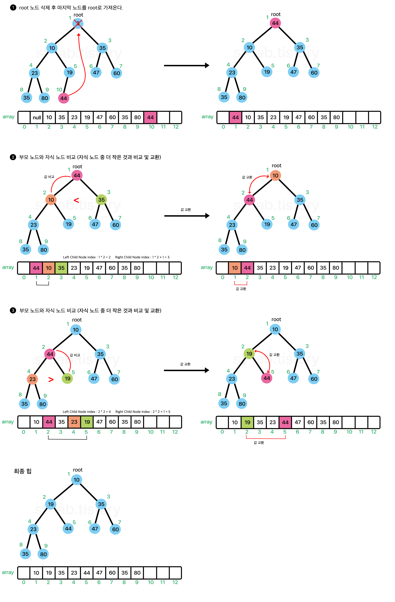

# Priority Queue( using array)
- 배열 힙 구현에서 봤듯이 우선순위 큐는 대체적으로 `Heap` 자료구조를 기반으로 구현된다. 
그리고 힙은 노드를 활용하여 연결리스트처럼 구현하는 방식이 있고, 배열을 활용하여 구현하는 방법이 있다.
- 힙의 특성상 배열을 이용하는 것이 훨씬 구현하기 편하다.

## Priority Queue(우선순위 큐)란 무엇인가? 
- 우선순위 큐는 각 요소들이 각각의 우선 순위를 갖고 있고, 요소들의 대기열에서 <b style="color:orange">'우선 순위가 높은 요소'가 '우선 순위가 낮은 요소'보다 먼저 제공되는 자료구조</b>이다.  
- 가장 많이 오해하는 포인트는 <b style="color:orange"> "우선순위 큐 = 힙" </b>이라는 것이다. 어찌보면 `heap`과 유사한 구조를 갖고 있으나, 엄연히 개념 자체가 다르다.  
- 힙은 기본적으로 중점이 되는 것이 <b style="color:orange">최솟값 또는 최댓값 빠르게 찾기</b>인 반면에 , 우선순위 큐는 우선순위가 높은 순서대로 요소를 제공 받는 다는 점이다.  
- 다른 예시를 들어보자면  
우리는 '리스트' 자료구조를 배웠었다. 리스트는 배열을 이용한 `ArrayList`와 노드 간의 연결을 이용한 `LinkedList`로 나뉜다. 
이 둘을 흔히 `리스트`라고 한다. 
즉 `리스트`라는 추상적인 자료구조 모델의 개념을 배열을 이용하느냐, 노드를 링크하는 방식을 이용하느냐를 통해 구체화 된 자료구조가 `ArrayList`나 `LinkedList`처럼 나오는 것이다.  
- 다른예시로는 
큐의 종류에서 하나는 배열을 이용한 방식, 하나는 연결리스트로 구현한 방식이었다. 즉, 큐는 추상적 개념을 구체화를 어떻게 하느냐에 따라 구현 행태가 달라지게 된다. 
다시 우선순위 큐로 돌아가본다.  
- 우선순위 큐는 우선순위를 갖는 요소를 우선적으로 제공 받을 수 있도록 하는 자료 구조다. 
이는 리스트처럼 '추상적 모델'개념에 좀 더 가깝고 , 이를 구현하는 방식은 여러 방식이 있다.  
- 그리고 <b style="color:orange"> 우선순위 큐를 구현하는데에 있어 가장 대표적인 구현 방식이 `Heap `자료구조를 활용하는 방식이라는 것</b>이다.  
- 힙(Heap)을 사용한 우선순위 큐(Priority Queue)는 어떻게 구현되는가?
이 부분은 힙과 내용이 겹치게 된다.  
- 힙에서는 <b style="color:orange"> "최대 혹은 최소 값"을 빠르게 찾기 위한</b>다고 했다. 이를 우선순위가 높은 요소를 빠르게 찾기 위한다고 바꾸어 생각하면 좀 더 편하다.  
- 어떤 리스트에 값을 넣었다가 빼려고 할때 우선순위가 높은 것부터 빼려고하면 보통 정렬을 떠올리게 된다. 
- 쉽게 생각해서 숫자가 낮을 수록 우선순위가 높다고 가정할 때 매 번 새 원소가 들어올 때 마다 이미 리스트에 있떤 원소들과 비교를 하고 정렬을 해야한다.  
- 문제는 이렇게 하면 비효율적이기 때문에 좀 더 효율을 좋게 만들기 위하여 다음과 같은 조건을 붙인다.  
  <b style="color:orange"> "부모 노드는 항상 자식 노드보다 우선순위가 높다."</b>  
모든 요소들을 고려하여 우선순위를 정할 필요 없이 부모 노드는 자식노드보다 항상 우선순위가 앞선다는 조건만 만족시키며 <b style="color:orange">완전이진트리 형태로 채워나가는 것</b>이다.
- 이것을 조금만 생각해보면 <b style="color:orange">루트 노드(root node)는 항상 우선순위가 높은 노드라는 것</b>이다.  
이러한 원리로 최대값 혹은 최소값을 빠르게 찾아낼 수 있다는 장점 (시간복잡도 :O(1))과 함께 삽입 삭제 연산시에도 부모노드가 자식노드보다 우선순위만 높으면 되므로 결국 트리의 깊이만큼만 비교를 하면 되기 때문에 O(logN)의 시간 복잡도를 갖아 매우 빠르게 수행할 수 있다.  
-  
- 위 이미지에서처럼 부모노드와 자식노드간의 관계만 신경쓰면 되기 때문에 <b style="color:orange">형제 간 우선순위는 고려되지 않는다.</b> 
이러한 정렬 상태를 흔히 <b style="color:orange">"반 정렬 상태"</b> 혹은 <b style="color:orange">"느슨한 정렬 상태"</b>, <b style="color:orange">약한 힙</b> 이라고도 불린다.   
- 왜 형제간의 대소비교는 필요가 없을까? 
우선 순위가 높은 순서대로 뽑는 것이 포인트이다.  즉, <b style="color:orange">원소를 넣을 때도 우선순위가 높은 순서대로 나올 수 있도록 유지가 되야하고 뽑을 때 또한 우선순위가 높은 순서 차례대로 나오기만 하면 된다.</b>  
### Heap을 이용한 Priority Queue의 종류
- 앞서 힙은 우선순위가 높은 순서대로 나온다고 했다. 이 말은 어떻게 우선순위를 매기냐에 따라 달라지겠지만 기본적으로 정수, 문자,문자열 같은 경우 언어에서 지원하는 기본 정렬 기준들이 있다.  
- 예를 들어 정수나 문자의 경우 낮은 값이 높은 값보다 우선한다. 
- 우리가 예로 {3,1,6,4}를 정렬한다고 하면 낮은 순서대로 {1,3,4,6}이렇게 정렬하게 된다. 이렇게 정렬 되는 순서, 즉 기본적으로 어떤 것을 우선순위가 높다고 할지에 따라 두가지로 나뉜다.
-   
최소 힙 : 부모 노드의 값(key 값) <= 자식 노드의 값 (key값) 
최대 힙 : 부모 노드의 값(key 값) >= 자식 노드의 값 (key값)  
이렇게 두 가지로 나뉜다. 
다만 ,  여기서 가장 기본 우선순위를 뽑는다고 하면 보통 "오름차순"을 생각하기도 하고 많은 언어들도 오름차순을 기본으로 하기 때문에 최소힙을 기준으로 구현한다.  

- 그럼 위의 트리 구조는 어떻게 구현할 것인가? 
- 가장 표준적으로 구현되는 방식은 '배열'이다, 물론 연결리스트로도 구현은 가능하긴 하지만, 문제는 특정 노드의 '검색', '이동' 과정이 조금 더 번거롭기 때문이다. 
배열의 경우는 특정 인덱스에 바로 접근할 수가 있기 때문에 조금 더 효율적이긴 하다.   
배열로 구현하게 되면 특징 및 장점들이 있다. 
-   
[ 특징 ] 
1. 구현의 용이함을 위해 시작 인덱스 (root)는 1부터 시작한다. 
2. 각 노드와 대응되는 배열의 인덱스는 "불변한다"  
위 특징을 기준으로 각 인덱스 별로 채워넣으면 특이한 성질이 나오는데 다음과 같다.
[ 성질 ]
   1. 왼쪽 자식 노드 인덱스 = 부모 노드 인덱스 x2
   2. 오른쪽 자신 노드 인덱스 = 부모 노드 인덱스 x 2 +1
   3. 부모 노드 인덱스 = 자식 노드 인덱스 /2   
이 세개의 법칙은 절대 변하지 않는다. 
예를 들어 index 3 의 왼쪽 자식 노드를 찾고 싶다면 3 x2 를 해주면 된다. 즉 index 6이 index 3의 자식 노드라는 것이다.  
반대로 index 5의 부모 노드를 찾고 싶다면 5/2를 해주면 된다. (몫만 취함) 그러면 2 이므로 index 2가 index 5 의 부모 노드라는 것이다.   

### Heap을 이용한 Priority Queue 구현
- 일단 기본적으로 최소 힙 (Min Heap)을 기준으로 구현한다. 최대 힙 또한 원리가 크게 다른 것은 아니다.  
[Priority Queue  클래스 및 생성자 구하기 ]  
- 이번에 구현 할 우선순위 큐는 배열 기반으로 구현한 Heap을 기반으로 구현한다.Priority 라는 이름을  생성.  
- Queue Interface 포스팅에서 작성 했던 Queue 인터페이스를 implements 해준다. 
- implements 를 하면 class 옆에 경고표시가 뜨는데, 인터페이스에 있는 메서드들을 구현하라는 것이다.

- offer 
  -   
- poll
  -   