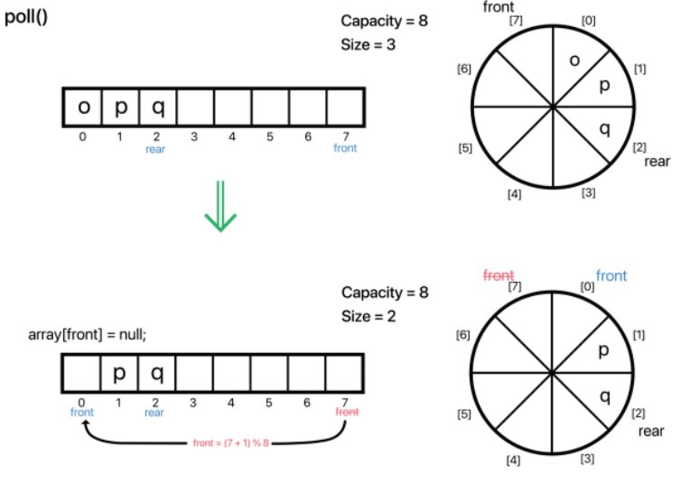

## Queue

### Queue란?
- Queue는 '대기열' 이라는 뜻이다.  
예를 들어서 에버랜드에 놀이기구를 타기 위해 줄을 서서 대기하는 열을 생각하면 된다.  
- Queue는 대기열 , 즉 "선입선출(First In, First Out)" 자료구조다. 먼저 들어온 것이 먼저 나가는 것이다.  
대표적으로 놀이공원의 대기 줄, 은행에서의 번호표를 받는 것도 Queue라고 할 수 있다.

### Queue는 어디에 활용할까?
- 쉽게 생각했을 때 시간 순으로 어떤 작업 또는 데이터를 처리할 필요가 있는 것들은 큐의 성질을 갖고 있다고 보면 된다.  
 또한 대표적으로 알고리즘에서는 BFS(너비 우선 탐색)에 사용된다.
- 자바에서 제공하고 있는 큐는 정확히 말하면 인터페이스에 불과하고, 큐를 구현하는 클래스는 크게 PriorityQueue(우선 순위 큐),ArrayDequeue(배열 양방향 큐), LinkedList(연결리스트)이렇게 3가지가 있다.  
  
즉, 어디까지나 실질적으로는 LinkedList처럼 객체를 연결한 방식 또는 PriorityQueue나, ArrayDeque처럼 배열에 의해 구현되기 때문에 정해진 방식이 있는것은 아니다.  

### Queue Interface Method  

|메서드|리턴 타입|설명|
|----|----|----|
|offer(E e)| boolean| 큐의 마지막에 요소를 추가한다.|
|poll()|E|큐의 첫 번째 요소를 제거하고 제거 된 요소를 반환한다.|
|peek()|E|큐의 첫 번째 요소를 제거하지 않고 반환한다.|  
- 큐 같은 경우는 실제로 자바에서도 6가지 밖에 선언되어있지 않다.
- offer()의경우 리스트에서의 add()와 비슷한 역할이고,   
poll()의 경우는 remove()와 비슷한 역할이며, peek()은 element()와 비슷한 역할이다.  
- 다만 차이점은 add(),remove(),element()는 내부적으로 예외를 처리하고 있다.  
예를 들어 index 밖을 넘어가거나, 삭제할 요소가 없거나 등등 이러한 예외적 경우에 대해 예외를 던졌다.
- 하지만 offer(), peek(), element()의 경우 예외를 던지는 것이 아닌 특별한 값을 던지는데,  
일반적으로 null또는 false를 던진다고 생각하면 된다.
- 큐는 기본적으로 FIFO 이다.  
-   
  
흔히 줄을 서서 대기하는 모습을 상상하면 된다.  
문제는 배열을 이용하여 구현 할 경우 문제가 있다.  
예를 들어 다음과 같이 배열에 원소들을 추가해놓았다고 가정해보자.
-   
그리고 큐는 선입선출이므로 __큐 원소를 삭제(poll)__ 할 경우 가장 앞에 있는 원소,  
즉 index 0의 원소가 삭제 된다.  
-   
그리고 위에서 다시 __원소를 추가(offer)__ 하면 맨 뒤의 원소 바로 뒷 자리,  
즉 index3 의 자리에 원소가 추가 된다.
-   
이런식으로 큐의 삽입 삭제가 반복되면 결국에 원소들이 뒤로 치우치게 되는 경우가 발생한다.
- 
- 이렇게 선형적으로 접근하게 되면 쏠림현상이 발생하는데,  
그렇다고 매 번 삭제 연산때마다 삭제된 원소 뒤의 모든 원소들을 한자리씩 앞으로 땡겨오는 것은 매우 비효율적이다.  
그렇다고 배열 크기를 늘리자니 배열이 꽉찬 상태인 것도 아니라 빈 공간을 낭비하게 된다.
- 이를 해결하기 위한 아주 간단한 방법은 앞의 빈 자리에 다시 채워넣는 것이다.  
배열을 원형이라고 생각하면 가장 마지막 원소의 위치를 가리키는 변수' front(앞)'와 'rear(뒤)'가 필요하다.  
- 
- __만약 원소를 추가한다면?__  0번째 인덱스에 원소를 추가하는 것이다.
- 
- 그리고 반대로 원소를 삭제하다면? front +1 번재, 즉 index 4에 위치한 원소가 삭제 되는 것이다.
-   
- 쉽게 생각하면 rear를 따라 원소가 추가 되고, front를 따라 원소가 삭제된다고 보면 된다.  
이와 같이 원소들을 채워 나가면 효율적으로 배열을 관리할 수 있다.  
만약에 '더이상 빈자리가 없을 경우'에만 배열의 크기를 늘려주면 된다.  
- 왜 fornt 변수 다음부터 원소가 추가 되는것냐면 연속으로 삭제하게 될 경우 다음과 같은 이유 때문에 일반적으로 front위치는 비워두고 다음 index부터 시작한다.
   - 
<B>[front 위치의 공간을 비우지 않을 경우]</B>

   - 
   - front와 rear가 엇갈려 버리게 된다.
   - 
   - 위 두 배열 모두 rear와 front가 각각 가리키는 위치는 같지만, <b>비어있는지 가득차있는지는 저 두 변수만으로는 알 수 없다는 것</b>이다.
- 
<B>[front 위치의 공간을 비어 있을 경우]</B>

  
- 이렇게 한 자리를 비움으로 front와 rear가 같은 경우 큐가 비어있음을 확인 할 수 있게 된다.
- 한마디로 front == rear 라면 큐는 비어있는 상태이며, 비어있다면 다시 두 변수 모두 0으로 초기화 해주면 더욱 깔끔해진다.  
이러한 구조를 보통 Circular Queue, 원형큐, 환형 큐 라고도 한다.
- 모든 자료 구조는 '동적할당'을 전제로 한다.  가끔 ArrayList나, Stack같이 Object[] 배열을 사용하는 자료 구조를 구현할 때,  
자료구조의 용적(Capacity)이 가득 차면 리스트의 크기를 늘리지 않고 , 그냥 꽉 찼다고 더 이상 원소를 안 받도록 구현하는 의미 없는 경우가 있다.  
동적 할당을 안하고 사이즈를 정해놓고 구현한다면 메인함수에서 정적배열을 선언하는 것과 차이가 없다.
- 큐의 기본 구조 선입선출
  - 
- front +1 하는 이유 
-   
- 위 두배열 모두 rear와 front가 각각 가리키는 위치는 같지만, 비어있는지 가득차있는지는 저 두변수만으로는 알 수가 없다.  
그럼 반대로 front 위치는 비우게 되면 어떻게 될까?
- offer ()
  - 
- poll ()
  - 