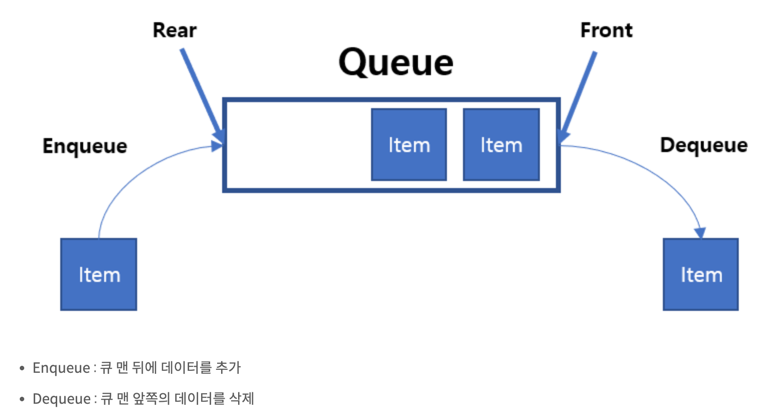
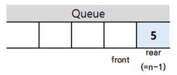
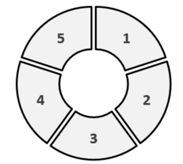

# Queue
## 큐란 ?
>가장 먼저 들어온 데이터가 가장 먼저 나가는 ```FIFO(First In First Out)```의 형태를 가지고 있는 구조를 말한다.
> 
> 
> >1. 큐의 한쪽 끝은 Front로 정하여 삭제연산만 수행한다.
> >2. 다른 한쪽 끝은 Rear로 정하여 삽입연삼나 수행한다.
> >3. 그래프 넓이 우선 탐색(BFS)에서 사용된다.
> >4. 컴퓨터 버퍼에서 주로 사용, 마구 입력이 되었으나 처리를 하지 못할 때, 버퍼(큐)를 만들어 대기 시킨다. 먼저 들어온 입력먼저 처리

* Queue를 활용한 서비스를 제공하는 Kafka의 경우 LIFO Queue를 제공하기도 한다
---
### Queue 종류

#### 1. 선형큐
>

- 크기에 제한이 있다
- 삭제가 발생하면 삭제된 자리는 비어있는 상태가 된다
- 계속 사용하기 위해서는 데이터들의 인덱스를 조절해야 한다. (빈공간으로 데이터들의 인덱스를 조절)

#### 2. 환형큐
>
- 선형큐의 단점을 보완하고자 등장
- Enqueue시 Rear가 1칸 움직인다. 단, (Rear + 1) % 배열크기 의 위치로 움직이게 된다
- Enqueue시 Front = Rear + 1인 경우 큐가 꽉차있다고 판단한다 
- Dequeue시 Front가 1칸 움직인.  단, (Front + 1) % 배열크기 의 위치로 움직이게 된다

#### 3. 링크드큐

- 연결리스트를 사용하여 구현
- 노드의 주소값을 참조하기 때문에, 크기에 제한이 없다

> ``` 크기제한 ```  환형큐(있음) / 링크드큐(없음)  <br>
> ``` 성능 ``` 환형큐 > 링크드큐 <br>
> ---
> ``` 결론 ``` 크기 예측이 불가능한 경우에는 링크드큐를 사용, 크기가 예측가능하고 고성능이 필요한 경우는 환형큐를 사용

---
### Java Queue Library 종류
#### 1. Queue 
- ```Queue<T> queue = new LinkedList<>();```
  - 링크드 큐
  - FIFO

#### 2. Deque (덱)
- ```Deque<T> deque = new LinkedList<>();```
  - Double-end queue 의 줄임말
  - 링크드 큐 이며, 앞/뒤 모두 데이터의 삭제와 삽입이 가능

#### 3. ArrayBlockingQueue 
- ```ArrayBlockingQueue<T> queue = new ArrayBlockingQueue<Integer>(10);```
- ```ArrayBlockingQueue<T> queue = new ArrayBlockingQueue<Integer>(10, true);```
  - 크기에 제한이 있음
  - 크기 변경 불가
  - 선택적으로 공평성 정책을 적용하여, block 한 Thread의 순차적 대기열 생성
  - 대기열 처리에 대한 정확한 순서 보장 x
#### 4. LinkedBlockingQueue
- ```LinkedBlockingQueue queue = new LinkedBlockingQueue();```
  - 크기를 지정하지 않으면 Integer.MAX
  - 용량을 초과하지 않으면 삽입마다 node가 생성, 초과시 block
#### 5. ConcurrentLinkedQueue
#### 6. PriorityBlockingQueue
- ```PriorityQueue<T> priorityQueue1 = new PriorityQueue<>();```
- ```PriorityQueue<T> priorityQueue2 = new PriorityQueue<>(Collections.reverseOrder());```
  - 크기 제한 없음
  - 우선순위 기준으로 데이터 추출
  - 입력무제한이기 때문에, 에러가 난다면 OutOfMemory 인 경우가 대부분

#### 7. SynchronousQueue
- ```SynchronousQueue<T> q = new SynchronousQueue<>();```
  - Queue의 삽입작업이 다른스레드의 삭제 작업과 반드시 함께 작동한다
  - 내부용량을 지니지 않는다 (null 허용x)
  - peek 불가능
  - poll 시 삽입요청을 한 Thread가 없다면 null 을 반환한다
---
##### [참고] 
- https://chanhuiseok.github.io/posts/algo-26/
- https://yongku.tistory.com/entry/%EC%9E%90%EB%B0%94Java-Queue-%ED%81%B4%EB%9E%98%EC%8A%A4-%EB%B0%8F-%EC%98%88%EC%A0%9C
- [Java 큐 라입러리 및 블로킹 큐](https://202psj.tistory.com/1609)
- [ArrayBlockingQueue](https://codechacha.com/ko/java-arrayblockingqueue/)
- [BlockingQueue vs ConcurrentLinkedQueue](https://jjaesang.github.io/java/2019/07/22/java-blockingqueue-vs-concurrentLinkedQueue.html)
- [PriorityQueue](https://crazykim2.tistory.com/575)