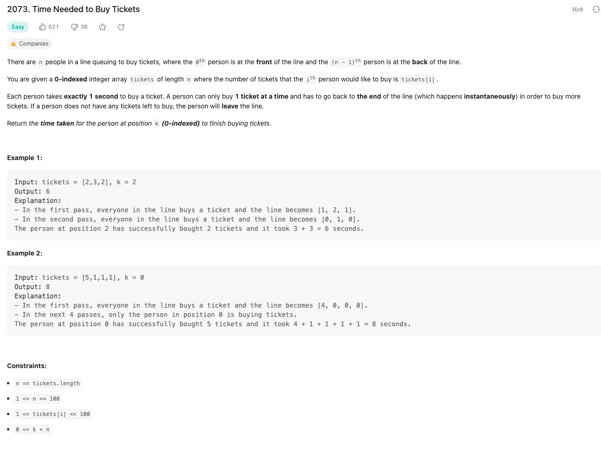
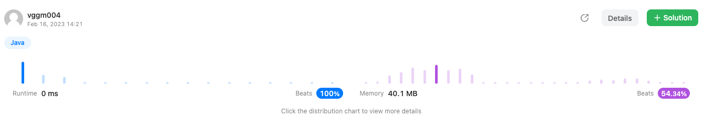

# Time Needed to Buy Tickets
##### https://leetcode.com/problems/time-needed-to-buy-tickets/

## 문제 설명
> 
---
### 실행결과
> 
---
### 최종 풀이 - TRY 1
~~~java
class Solution {
    public int timeRequiredToBuy(int[] tickets, int k) {
        int result = 0;
        int target = tickets[k];

        for (int i = 0; i < tickets.length; i++) {
            int qty = tickets[i];

            result += (i <= k ? (qty <= target ? qty : target) : (qty < target ? qty : target - 1));
        }

        return result;
    }
}
~~~
---
### TRY 1
- 성공
~~~java
class Solution {
    public int timeRequiredToBuy(int[] tickets, int k) {
        int result = 0;
        int target = tickets[k];

        for (int i = 0; i < tickets.length; i++) {
            int qty = tickets[i];

            result += (i <= k ? (qty <= target ? qty : target) : (qty < target ? qty : target - 1));
        }

        return result;
    }
}
~~~
---
### 다른 사람의 풀이
~~~java
class Solution {
    public int timeRequiredToBuy(int[] tickets, int k) {
        int sum=0;
        for(int i=0;i<tickets.length;i++){
            sum +=Math.min(tickets[i],tickets[k]-((i>k)?1:0));
        }
        return sum;
    }
}
~~~
