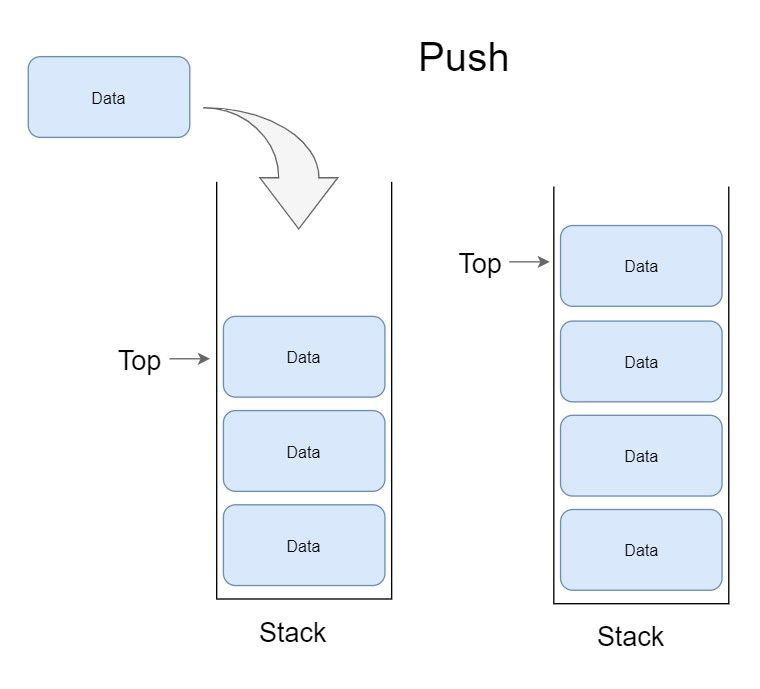
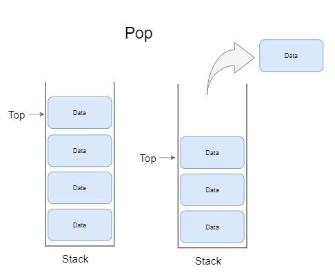
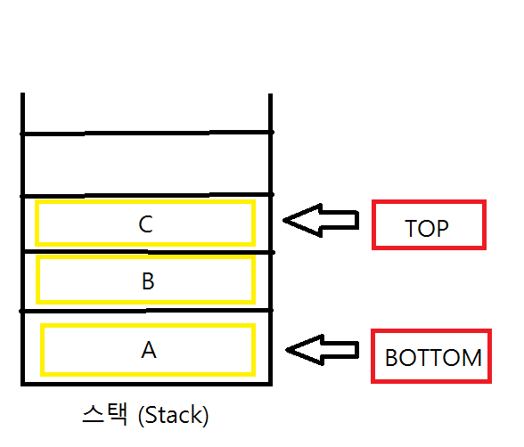

# Stack

### Stack이란
 메모리의 스택 영역은 함수의 호출과 관계되는 지역변수, 매개변수, 리턴 값등의 임시데이터를 저장합니다. \
 스택이란 단어는 ‘차곡 차곡 쌓여진 더미’를 의미합니다.\
 FILO(First In Last Out, 선입후출), LIFO(Last In First Out, 후입선출) 구조라고도 합니다.\

 스택은 연결 리스트와 아주 유사하기 때문에, 배열로 구현이 가능합니다.\
 이 배열 스택은 가장 단순한 형태의 스택으로 데이터의 삽입과 삭제에 해당하는 시간 복잡도가 모두 O(1)입니다.\
 하지만, 배열의 고정적 사이즈 때문에 존재하는 메모리 한계를 가지고 있습니다.

위 단점을 커버하기 위해서 만들어진 것은 놀랍게도 연결 리스트와 동일합니다. \
단지, 삽입과 삭제의 순서가 정해져 있는 연결 리스트일 뿐입니다. \
시간 복잡도 측면에서는 연결 리스트로 구현된 스택과 배열 스택 모두 동일합니다.

### Stack 작업 및 추상화
push - 스택 맨위에 항목을 삽입\
pop - 스택 맨위에 항목 삭제\
peek or top - 스택의 맨 위(top)를 표시\
isEmpty - 스택이 비어있는지 확인\
isFull - 스택이 가득 차 있는지 확인\
getSize - 스택에 있는 요소 수를 반환

### Push 작업
데이터를 스택에 넣는 작업을 push 라고 합니다. push는 다음 단계를 거칩니다.

1 단계 - 스택이 가득 찼는 지 확인합니다.\
2 단계 -스택이 가득 차면 오류가 발생하고 종료됩니다.\
3 단계 -스택이 가득 차지 않으면 Top을 증가시킵니다.\
4 단계 - Top이 가리키는 스택 위치에 데이터를 추가합니다.\

### Pop 작업
데이터를 스택에 제거하는 작업을 pop이라고 합니다. pop은 다음 단계를 거칩니다.

1 단계 -스택이 비어 있는지 확인합니다.\
2 단계 -스택이 비어 있으면 오류가 발생하고 종료됩니다.\
3 단계 -스택이 비어 있지 않으면 Top 이 가리키는 데이터를 제거합니다.\
4 단계 -Top 값을 감소시킵니다.\
5 단계 -성공을 반환합니다.

#### Top Bottom

만약 스택이 비어있을 때 자료를 꺼내려고 시도를 하면 스택 언더플로우(Stack Underflow)가 발생하고
반대로, 스택이 꽉 차있을 때 자료를 넣으려고 하면 스택 오버플로우(Stack Overflow)가 발생하게 됩니다.

### Stack 활용
웹 브라우저 뒤로가기 : 가장 나중에 열린 페이지부터 뒤로 가기를 실행합니다.
문서작업에서 Ctrl+Z : 가장 나중에 수정한 내역부터 되돌립니다.
역순 문자열 만들기 : 맨 끝의 문자열부터 차례대로 만들어집니다.
