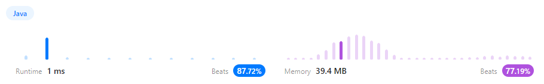
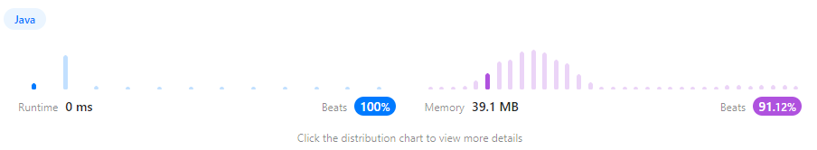

Write an algorithm to determine if a number n is happy.

        A happy number is a number defined by the following process:

        Starting with any positive integer, replace the number by the sum of the squares of its digits.
        Repeat the process until the number equals 1 (where it will stay), or it loops endlessly in a cycle which does not include 1.
        Those numbers for which this process ends in 1 are happy.
        Return true if n is a happy number, and false if not.

        숫자가 n만족스러운지 판단하는 알고리즘을 작성하세요.
        
        행복한 숫자는 다음 프로세스에 의해 정의된 숫자입니다.
        
        양의 정수로 시작하여 해당 숫자의 제곱의 합으로 숫자를 바꿉니다.
        숫자가 1이 될 때까지 프로세스를 반복하거나(남을 위치) 1을 포함하지 않는 주기에서 무한 반복합니다 .
        이 프로세스가 1로 끝나는 숫자는 행복합니다.
        가 행복한 숫자이면 true 반환 하고 그렇지 않으면 를 반환합니다 .n false


        Example 1:

        Input: n = 19
        Output: true
        Explanation:
        1의 2제곱 + 9의 2제곱 = 82
        8의 2제곱 + 2의 2제곱 = 68
        6의 2제곱 + 8의 2제곱 = 100
        1의 2제곱 + 0의 2제곱 + 0의 2제곱 = 1

        Example 2:

        Input: n = 2
        Output: false

        Constraints:

        1 <= n <= 2의 31제곱 - 1

        1로 끝나려면 1, 10, 100, 1000, 10000등의 숫자가 되어야함

        1로 끝나지 않으려면 무한 반복을 하는 경우
        -> 기존에 1이 아닌 값이 반복되는 경우
        ->
            예) 2 -> 2*2= 4 -> 4*4 = 16 -> 1*1+6*6 = 37 -> 3*3+7*7 = 58 -> 5*5+8*8 = 89
             -> 8*8+9*9 = 145 -> 1*1+4*4+5*5 = 42 -> 4*4+2*2 = 20 -> 2*2+0*0 = 4 <= 2번의 2번째 때 나온 값
                3 -> 3*3 = 9 -> 9*9 = 81 -> 8*8+1*1 = 65 -> 6*6+5*5 = 61 -> 6*6+1*1 = 37
             -> 3*3+7*7 = 58 -> 5*5+8*8 = 89 -> 8*8+9*9 = 145 -> 1*1+4*4+5*5 = 42 -> 4*4+2*2 = 20 -> 2*2+0*0 = 4 <= 2번의 같은 루트
                4 <= 2번과 같은 루트
                5 -> 5*5= 25 -> 2*2+5*5 = 29 -> 2*2+9*9 = 85 -> 8*8+5*5 = 89 <= 2번의 5번째와 같은 루트
                6 -> 6*6= 36 -> 3*3+6*6 = 42 <= 3번의 9번째와 같은 루트
                7 -> 7*7= 49 -> 4*4+9*9 = 97 -> 9*9+7*7 = 130 -> 1*1+3*3+0*0 = 10 = 1*1+0*0 = 1 <= happynumber
                8 -> 8*8= 64 -> 6*6+4*4 = 52 -> 5*5+2*2 = 29 <= 5번의 2번째와 같은 루트
                9 <= 3번의 2번째와 같은 루트

         -> 예)에서 보면 자릿수는 세자리를 넘어가지 않음 999 -> 9*9+9*9+9*9 = 243 한자리 숫자의 제곱을 몇번 더하더라도 3자리숫자로 리턴


```java
import java.util.HashSet;

public class happyNumber {
public static void main(String[] args) {
System.out.println(isHappy(19));
}

    public static boolean isHappy(int n) {
        boolean result = true;

        HashSet<Object> hashSet = new HashSet<Object>();
        int sum;

        while (n != 1) {
            sum = 0;
            while (n != 0) {
                sum += ((n%10) * (n%10));
                n = n/10;
            }
            n = sum;
            if(hashSet.contains(n)) {
                result = false;
                break;
            }
            hashSet.add(sum);
        }

        return result;
    }
}
```





         -> 위의 예에서 보면 한자리 숫자들은 1 혹은 4로 반복문이 돌음
         -> 그리고 결국 한번은 한자리 숫자로 오고 1 혹은 4로 돌아옴

```java
class Solution {
    public boolean isHappy(int n) {
        boolean result = true;
        int sum;
        while (n != 1) {
            sum = 0;
            if(n == 4) {
                result = false;
                break;
            }
            while (n != 0) {
                sum += ((n%10) * (n%10));
                n = n/10;
            }
            n = sum;
        }
        return result;
    }
}
```


