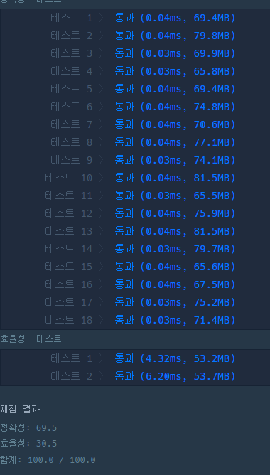

/*
문제 설명
괄호가 바르게 짝지어졌다는 것은 '(' 문자로 열렸으면 반드시 짝지어서 ')' 문자로 닫혀야 한다는 뜻입니다. 예를 들어

"()()" 또는 "(())()" 는 올바른 괄호입니다.
")()(" 또는 "(()(" 는 올바르지 않은 괄호입니다.
'(' 또는 ')' 로만 이루어진 문자열 s가 주어졌을 때, 문자열 s가 올바른 괄호이면 true를 return 하고, 올바르지 않은 괄호이면 false를 return 하는 solution 함수를 완성해 주세요.

제한사항
문자열 s의 길이 : 100,000 이하의 자연수
문자열 s는 '(' 또는 ')' 로만 이루어져 있습니다.
입출력 예
s	answer
"()()"	true
"(())()"	true
")()("	false
"(()("	false
입출력 예 설명
입출력 예 #1,2,3,4
문제의 예시와 같습니다.

여는 괄호로 시작해야함
닫는괄호로 끝나야함
닫는 괄호가 시작할 때 여는 괄호보다 갯수가 많으면 안됨

if문에서 이미 시작 단어를 체크 하니 for문에선 1부터 시작

```java
public class progremmers {
    boolean solution(String s) {
        boolean answer = true;
        char[] charArr = s.toCharArray();
        int checkCount = 1;

        if(charArr[0] == ')' || charArr[s.length()-1] == '(') {
            answer = false;
        }

        if(answer) {
            for (int i = 1; i < charArr.length; i++) {
                if(charArr[i] == '(') {
                    checkCount++;
                } else {
                    checkCount--;
                }

                if(checkCount < 0) {
                    answer = false;
                    break;
                }
            }
        }
        if(checkCount != 0) {
            answer = false;
        }
        return answer;
    }
}
```


끝에 닫는 것도 for문에서 제외 하면 조금이나마 속도나 메모리를 덜 사용하지 않을까 해서 테스트
```java
public class progremmers {
    boolean solution(String s) {
        boolean answer = true;
        char[] charArr = s.toCharArray();
        int checkCount = 1;

        if(charArr[0] == ')' || charArr[s.length()-1] == '(') {
            answer = false;
        }

        if(answer) {
            for (int i = 1; i < charArr.length-1; i++) {
                if(charArr[i] == '(') {
                    checkCount++;
                } else {
                    checkCount--;
                }

                if(checkCount < 0) {
                    answer = false;
                    break;
                }
            }
            if(checkCount != 1) {
                answer = false;
            }
        }
        return answer;
    }
}

```



toCharArray로 미리 배열을 만들지 않고 사용하는 방법 매번 string을 배열로 해서인지 더 느려짐


```java
public class progremmers {
    boolean solution(String s) {
        boolean answer = true;
        int checkCount = 1;

        if(s.charAt(0) == ')' || s.charAt(s.length()-1) == '(') {
            answer = false;
        }

        if(answer) {
            for (int i = 1; i < s.length()-1; i++) {
                if(s.charAt(i) == '(') {
                    checkCount++;
                } else {
                    checkCount--;
                }

                if(checkCount < 0) {
                    answer = false;
                    break;
                }
            }
            if(checkCount != 1) {
                answer = false;
            }
        }
        return answer;
    }
}

```
