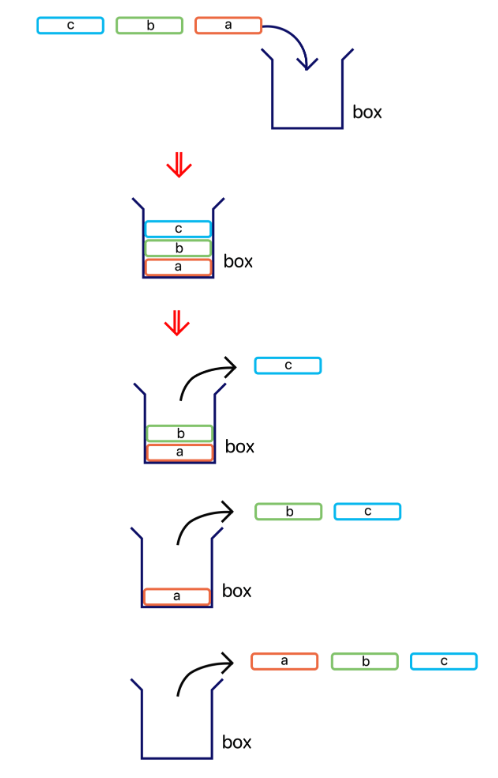
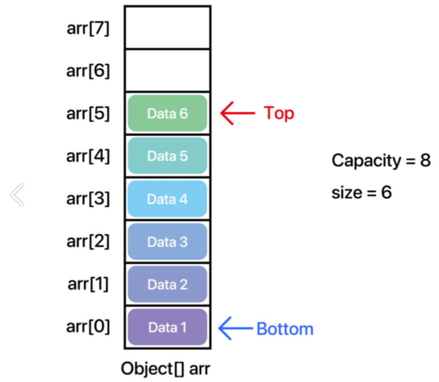
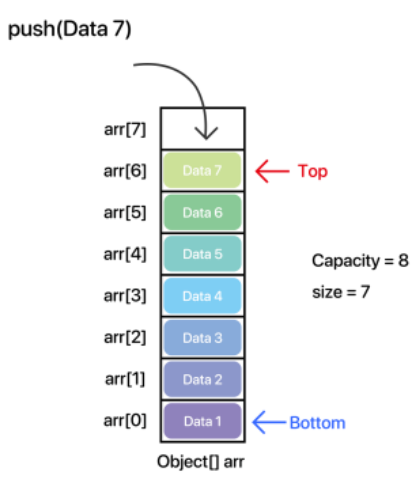
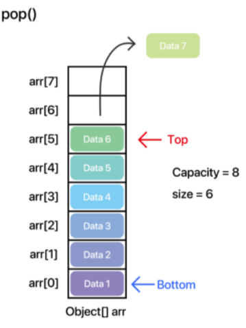
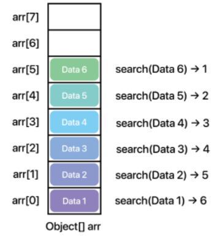

# Stack

## stack 이란?
- Stack은 말 그대로 '~을 쌓다'라는 의미다.  
예시로 벽돌을 쌓는다고 가정해보자.  
그러면 먼저 들어온 벽돌은 가장 아래로 위치하고, 가장 나중에 들어온 벽돌은 가장 위에 위치할 것이다.  
그리고 이 벽돌들을 치운다고 생각해보자, 그렇다면 하단에 있는 벽돌부터 뺄 것인가?  
가능은 하겠지만 보통 안정성등등의 이유로 위에 있는 벽돌부터 빼낼 것이다.  
이렇게 먼저 들어온 데이터가 마지막에 나가는 구조를 후입선출(LIFO = Last in First Out) 또는 선입후출 (FILO = First in Last out)이라고 한다.  
- 코딩 중 'java.lang.StackOverflowError'를 경험할텐데 보통은 재귀가 깊어지면서 발생한다.  
이는 메서드를 호출 할 때마다 메소드 내에 정의된 변수들의 값이 stack 메모리에 쌓이게 되는데 재귀가 깊어지면 stack 메모리에 이 값들이 쌓이면서  
해당 총량이 할당 된 메모리 양보다 커질 때 내뱉게된다.

- 참고로 나바 내부에서 스택은 Vector클래스를 상속받아 사용한다.  
Vector 자료구조는 ArrayList와 크게 다르지 않다.  
내부 구조는 Object[] 배열로 데이터들을 관리하여 전체적인 메서드 구조 또한 많이 유사하다.  
다만 차이점은 동기화를 지원하냐 안하냐의 여부인데, ArrayList에서는 동기화를 지원하지 않고, Vector에서는 동기화를 지원한다.  
그렇다보니 속도 자체는 ArrayList가 조금더 빠르지만, Thread safe 하지 않다.  
쉽게 생각해서 멀티 스레드 환경에서는 Vector를 아닐경우 ArrayList 를 쓰는것이 현명하다.

### 실생활에서 Stack의 형태

### Stack의 활용
1. 페이지 뒤로가기
2. 실행 취소
3. 수식 괄호 검사

가장 대표적인 것은 위 3가지 일것 이다.
- 페이지 뒤로가기는 우리가 대표적으로 가장 친숙하게 이용하는 스택 자료구조 형태이다.  
가장 최근에 방문했던 페이지가 가장 상단에 위치한다. 실행취소(Undo)또한 마찬가지다.  
  
수식 괄호 검사의 경우 처음 본다면 생소할 수 있지만 괄호 검사를 가장 쉽게할 수 있는 방법 중 하나다.  
여는 괄호'('가 있따면 반드시 닫는 괄호 ')'가 있어야 한다. 어느 하나라도 부족하거나 많을 경우 올바른 수식이 완성되지 않는다.

구럼 이제 Stack 인터페이스에 구현된 메서드들을 살펴보아야 한다.   
여기서 모든 메소드들을 살펴볼 수 없고, 몇가지 자주 사용하는 메서드들이 있다.

### <Stack Interface에 선언된 대표적인 메서드>
|메서드|리턴 타입|설명|
|----|----|----|
|push(E item)|E|스택의 맨위에 요소를 추가한다.|
|pop()|E| 스택의 맨 위의 요소를 제거하고 제거 된 요소를 반환한다.|
|peek()|E|스택의 맨 위의 요소를 제거하지 않고 반환한다.|
|search(Object o)|int|스택의 상단부터 탐색하여 지정된 객체가 있는 요소의 위치를 반환한다. 없을 경우 -1을 반환한다.|
|size()|int|현재 스택에 있는 요소의 개수를 반환한다.|
|clear()|void|모든 요소들을 제거한다.|
|empty()|int|현재 스택에 요소가 존재하지 않는 경우 true를, 그 외의 경우는 false를 반환한다.|

그리고 중요한 것은
search() 메서드는 스택 내부 배열의 인덱스 값이 아니라 __스택의 '상단으로부터 몇 번째에 위치 하는지'를 반환하는 것__ 이다.  
즉, 거리 개념이라고 보면 된다. 어떤 의미인지 모르겠다면 아래 인터페이스 구현에서 자세히 다시 확인해보자 .  
  
앞서 더보기를 통해 추가 설명을 들었다면 알겠지만, 자바에서는 Vector클래스를 상속받다보니 위의 클래스보다 훨씬 많은 메소드를 지원한다.  
즉, Vector 클래스에 있는 메서드 + 위에서 선언된 메서드를 합쳐야 하지만 이번에는 '스택'이 무엇인지에 좀 더 집중하고자,  
위의 메서드와 몇 가지 메서드를 추가하여 구현 해보자.  
  
그럼 자료구조를 만들고자 할 때, 인터페이스들은 같은 프로젝트 폴더 안에 다른 package를 하나 만들어서 그 안에 모아놓는 것을 추천한다.  
(예 Interface_form 패키지)

- Java에서 제공하는 stack 라이브러리는 'Vector'클래스를 상속 받아 구현하고 있다.  
즉 Stack 클래스에서도 Vector 클래스의 메서드들을 사용할 수 있게 되어 있다, Vector 클래스는 기본적으로 'ArrayList'와 그 구조가 거의 같다.  
기본적을 Stack 클래스는 내부에서 최상위 타입 배열인 __Object[] 배열을 사용하여 데이터들을 관리__ 하고 있다. 그러면 스택의 구조를 확인해보자.  
- 스택의 기본 원칙이 '후입선출(LIFO : Last in First out)'이다. 또는 선입선출 (FILO : First in Last out)이라고도 한다.  
- 
- 이사를 간기 위해 박스에 물건들을 넣는다고 생각했을때,  
먼저 a라는 짐을 넣고, 다음은 b, 다음은 c를 순서대로 박스에 넣었다.  
이제 이 박스를 들고 새로운 집에 도착했다. 그리고 박스를 열어 박스에 있던 짐들을 하나씩 꺼내려 한다.  
그럼 어떤 것부터 꺼낼까, 가장 위에 있던 물건부터 뺄 것이다.  

즉, 먼저 들어온 것은 가장 아래에 있고, 가장 아래에 있는 만큼 가장 나중에 빠져나오게 된다.  
  
이러한 구조는 보통어디서 쓰이냐면 '뒤로가기', '실행 취소',그리고 컴퓨터 구조에서 'stack memory'가 대표적이다.  
  
스택의 장점은 후출선입인 만큼 직전의 데이터를 빠르게 갖고 올 수 있다는 것이다.  
또한 균형성 검사를 할 수 있기 때문에 수식, 괄호 등의 검사에서도 쓰인다.  
  
그럼 어떻게 구현 해야할까?  
일단 Obejct[] 배열을 사용한다는 것은 알았다.  세로로 세운 그림을 보자면

  
  
이러한 구조로 되어있다고 보면 된다. 일단 하나하나 설명해보자면 이렇다.  
  
Bottom : 가장 밑에 있는 데이터 또는 그 데이터의 인덱스를 의미한다.
Top : 가장 위에 있는 데이터 또는 그 데이터의 인덱스를 의미한다.
Capacity : 데이터를 담기 위한 용적
size : 데이터의 개수 

그리고 __데이터를 추가하는 작업__ 을 __Push__ 라고 한다. (리스트에서의 add와 같은 역할이다.)
또한 __데이터를 삭제하는 작업__ 을 __pop__ 이라고 한다. (리스트에서의 remove와 같은 역할)

특징이라면 push 는 데이터를 기존의 리스트와 같은 메커니즘으로 인덱스가 증가하면서 추가하지만,  
삭제는 리스트와는 달리 ' 가장 마지막 데이터'를 삭제한다. (리스트에서의 remove()는 대게 가장 앞의 원소를 삭제한다.)  
  
아래와 같다. 
<h4> [ push ] </h4>  

-----
<h4> [ push ] </h4>  

  
그럼 본격적으로 Stack을 구현하기 전에 알아가야할 것이 있다.  
모든 자료구조는 '동적 할당'을 전제로 한다.  
가끔 ArrayList, Stack 같이 Object[] 배열을 사용하는 자료구조를 구현 할 때,
자료구조의 용적(Capacity)이 꽉 차면 리스트이 크기를 늘리지 않고 그냥 꽉 찼다고 더 이상 원소를 안받도록 구현한 경우가 많은데,  
이는 자료구조를 구현하는 의미가 없다.  
  
동적 할당을 안하고 사이즈를 정해놓고 구현한다면 메인함수에서 정적배열을 선언하는 것과 차이가 없다.  
  
데이터의 개수를 알 수 없는데 배열을 쓰고 싶을 때 여러분은 어떤 방법을 선택하는가 ?  
ArrayList, LinkedList 등의 자료구조를 선택할 것이다. 왜냐하면 사이즈를 정하지 않고 동적으로 활용할 수 있기 때문이다  
그렇기 때문에 당장은 어렵다고 하더라도 반드시 동적 할당이 가능한 형태로 구현하도록 노력해야 한다.  

- search(Object o) 메서드
- 
- 이는 '찾으려는 데이터가 상단의 데이터로부터 얼마만큼 떨어져있는지'에 대한 상대적 위치 값이다.  
말로는 어렵긴하지만, 그림을 보면 이렇다.
- 