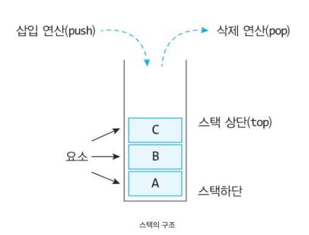

# STACK
## 스택이란 ?
>가장 늦게 들어온 데이터가 가장 먼저 나가는 ```LIFO(First In First Out)```의 형태를 가지고 있는 구조를 말한다.
> 
> 
> >1. 스택은 push를 통해 데이터를 삽입한다
> >2. 스택은 pop을 통해 가장 마지막에 들어온 데이터를 출력 한다.
> >3. 동적 스택을 구현할 수 있다 (ArrayList 사이즈 동적처리와 비슷)

##### [참고] 
- [스택](https://velog.io/@alkwen0996/%EC%9E%90%EB%A3%8C%EA%B5%AC%EC%A1%B0-%EC%8A%A4%ED%83%9DStack)
- [Stack 메모리 영역을 변경하여 성능 개선 heap->stack](https://megayuchi.com/2018/02/21/stack%EC%9D%84-heap%EB%8C%80%EC%8B%A0-stack%EC%97%90-%EC%98%AC%EB%A0%A4%EC%84%9C-%EC%96%BB%EC%9D%80-%EC%84%B1%EB%8A%A5-%EC%9D%B4%EB%93%9D/)
